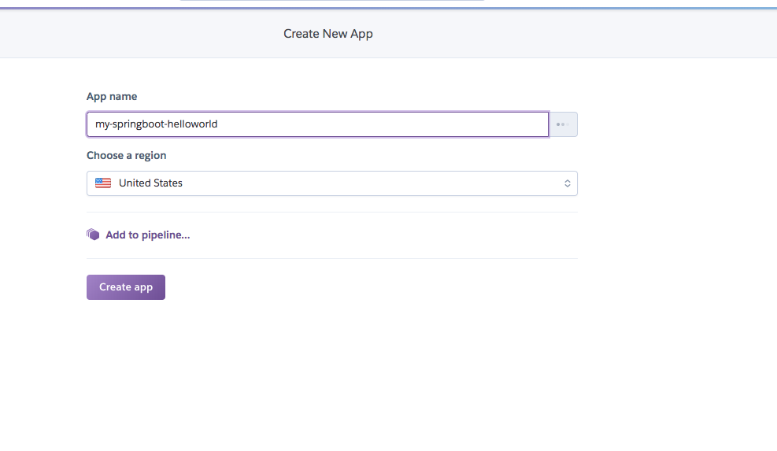
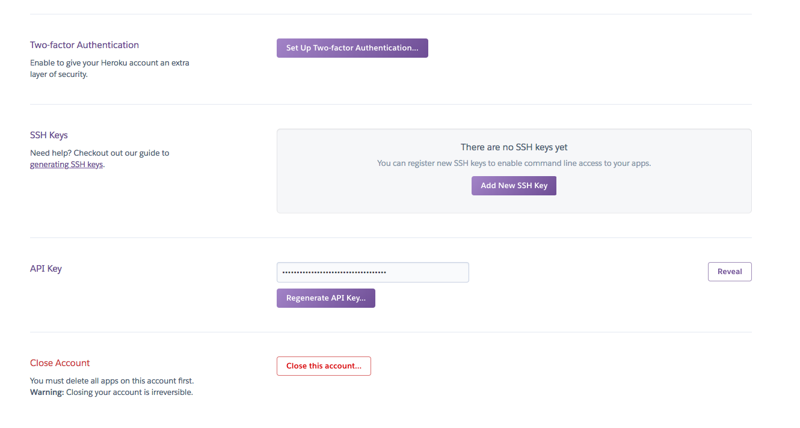
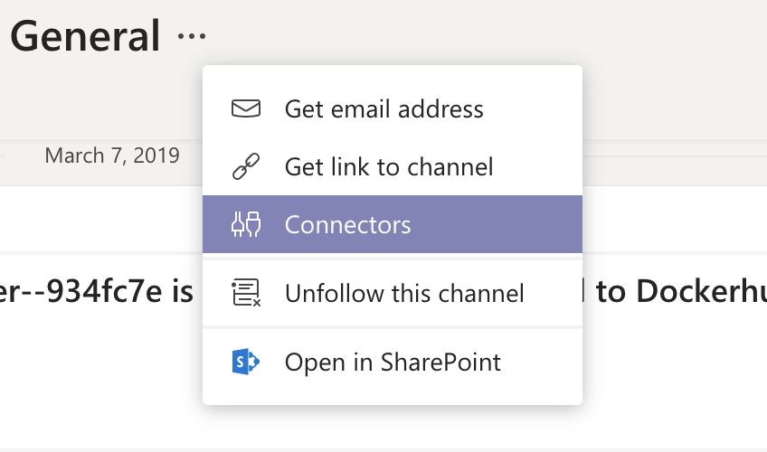
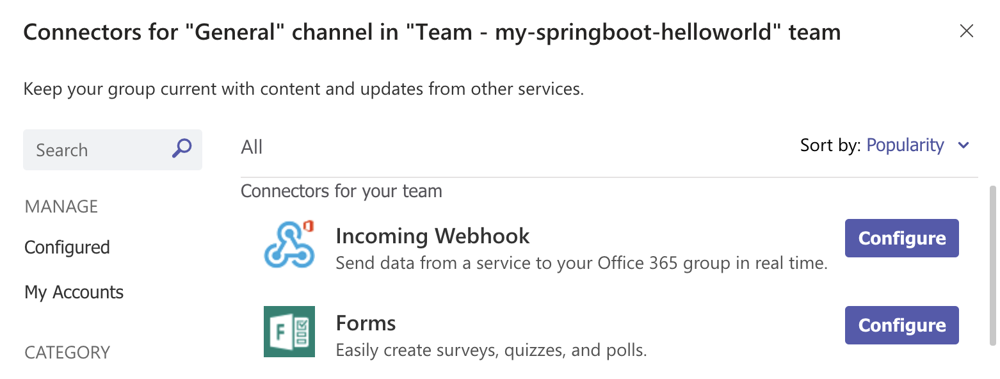
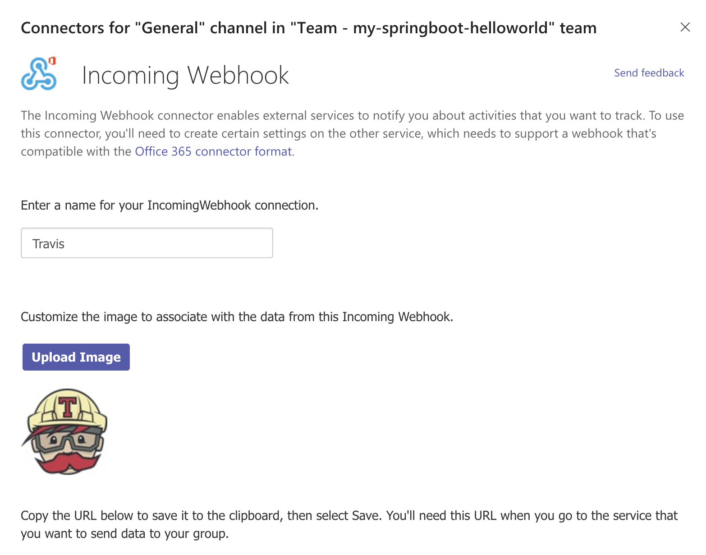
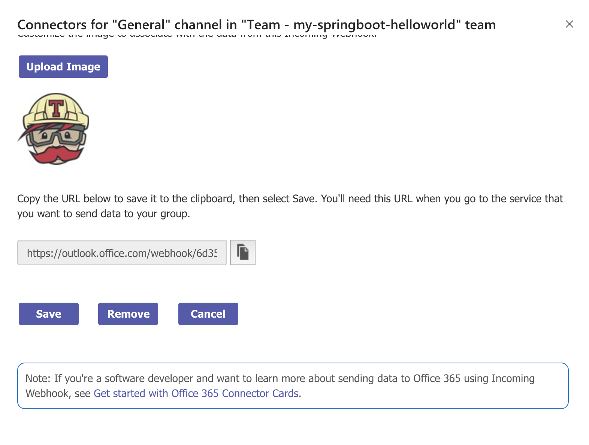
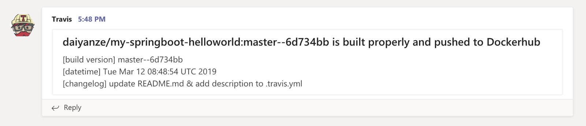
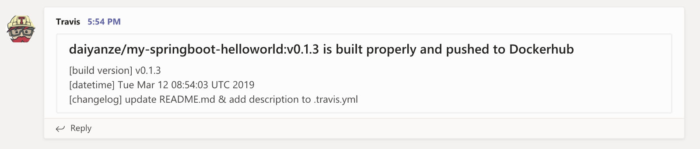

Our target in this article here is to let you know how to deploy the application to Heroku cloud with Dockerhub and Travis CI.
The code example is uploaded to Github repository [my-springboot-helloworld](https://github.com/daiyanze/my-springboot-helloworld).
TL DR;
Please skip to step 3 if you are ready with a Github repository and a simple Spring Boot application. You also need to have Travis Dockerhub and Heroku accounts before start. They are all free to register.

## 1. Github
First things first, we need a project repository on Github. I created one named my-springboot-helloworld. And ignore the target/ folder to avoid adding build files into git repo.
You may either create one of your own or clone my repo for convenience.

```sh
$ git clone https://github.com/daiyanze/my-springboot-helloworld.git
$ cd my-springboot-helloworld
```

## 2. Spring Boot
It would be easier to go with the official project repo gs-spring-boot.Yet, the Spring Boot official website provides the tutorial for creating a "Hello World" application.
I only copied src/ folder and pom.xml file from gs-spring-boot repo into my project folder my-springboot-helloworld/ as following.

```sh
my-springboot-helloworld/
-- src/
-- pom.xml
```

My HelloController looks like this after modification. The endpoint "/" will return a string of "\<h2\>Hello World!\<\/h2\>" .

```java
// my-springboot-helloworld/src/main/java/hello/HelloController.java
package hello;

import org.springframework.web.bind.annotation.RestController;
import org.springframework.web.bind.annotation.RequestMapping;

@RestController
public class HelloController {

    @RequestMapping("/")
    public String index() {
        return "<h2>Hello World!</h2>";
    }

}
```

I want to use a different port other than the SpringBoot default port 8080 , 9908 (a random number) for instance. Create a new file named application.yml under config/.

```yml
# config/application.yml
server:
  port: 9908
```

Alright, it seems everything is Okay! We could build our .jar file now with the following command.

```sh
$ mvn package
```

It will generate a new folder target/ (git-ignored) where your .jar file is inside.

```txt
my-springboot-helloworld/
-- src/
-- target/
   ...
   gs-spring-boot-0.1.0.jar
-- pom.xml
```

Test if it runs properly.

```sh
$ mvn spring-boot:run
or
$ java -jar target/*.jar
```

Access localhost:9908
LGTM!


## 3. Docker
Use Docker to create an image and push it to your Dockerhub repository (Create one here on https://hub.docker.com/). It is recommended to name your Dockerhub repo same with your Github repo. Mines are the same: daiyanze/my-springboot-helloworld.
After Dockerhub repo gets ready, we need to create a Dockerfile for the project.

```dockerfile
# my-springboot-helloworld/Dockerfile
FROM openjdk:8-jre-alpine
ENV APP_ROOT /app
RUN mkdir ${APP_ROOT}
WORKDIR ${APP_ROOT}
COPY target/*.jar ${APP_ROOT}/run.jar
ENTRYPOINT ["java", "-jar", "run.jar"]
```

It's also good to use docker-compose for building the image. Here is the docker-compose.yml.

```yml
version: "3"
services:
  app:
    build: .
    image: daiyanze/my-springboot-helloworld:latest
    container_name: hello-world
```

We've already built the .jar file on step 2. Now we could test building a Docker image for our app.

```sh
$ docker-compose build
...
$ docker image ls
REPOSITORY                      TAG  IMAGE ID      CREATED   SIZE
my-springboot-helloworld_app  latest b73ca880fe7c  1 min ago 101MB
$ docker-compose up
...
```

Access localhost:9908
LGTM!


## 4. Heroku
Create an app named my-springboot-helloworld first.


Copy and paste your API key from Account Settings to a safe place. We are going to use the API key for Travis later.
Done! Settings about Heroku is just this simple.



## 5. Teams Incoming Hook
Create a team if necessary. We will use the General channel to receive messages from Travis.<br />

Add a connector to our channel


Select "Incoming Webhook"


Pick a cool icon for Travis.


Save the channel url. We will use it later on Travis settings.


## 6. Travis
Setting up Travis is perhaps an easy part if you have experience on using CI/CD. With Travis CI, we are going to automate the following processes that "should" be done by the server.

1. Test & build our "Hello World" project
2. Create Docker image and push to our Dockerhub repository
3. Deploy the app to Heroku Cloud
4. Send build/deploy messages to Teams channel

To start using Travis, we need a setup file for Travis which defines what to do after we triggered the job. Let's create a file named .travis.yml. And put in some basic settings in it. The following settings mean that our application needs openjdk8 which Travis will help install it for us. And if we want to use Docker commands in our job, then we'll have to add docker to services property.

```yml
# .travis.yml
language: java
jdk:
  - openjdk8
services:
  - docker
```

We're gonna need some global variables for other scripts to reuse later. And of course those global variables can be encrypted for security purposes since those settings are open to public in Github. In our case, we need the following variables:

```yml
# env:
#   global:
#     secure: IMAGE_NAME
#     secure: HEROKU_API_KEY
#     secure: DOCKER_USER
#     secure: DOCKER_PASS
#     secure: TEAMS_CHANNEL_URL
```

My repo and image name are the same: "my-springboot-helloworld".<br />

As I mentioned above, we will use Dockerhub and Heroku to help us deploy the application. So the authorization of our identity on both sites is apparently inevitable.<br />

Let's encrypt the Heroku API key we saved from step 4 (Heroku).

```sh
$ travis encrypt HEROKU_API_KEY="******"
Please add the following to your .travis.yml file:
  secure: "<encrypted_HEROKU_API_KEY>"
```

Copy the <encrypted_HEROKU_API_KEY> and paste it in our .travis.yml file. (Don't need the double quote mark)

```yml
# .travis.yml
language: java
jdk:
  - openjdk8
services:
  - docker
env:
  global:
    - secure: <encrypted_HEROKU_API_KEY>
```

Repeat the encryption for your Dockerhub account and Teams channel url.

```yml
$ travis encrypt DOCKER_USER="******"
Please add the following to your .travis.yml file:
  secure: "<encrypted_DOCKER_USER>"
$ travis encrypt DOCKER_PASSWORD="******"
Please add the following to your .travis.yml file:
  secure: "<encrypted_DOCKER_PASSWORD>"
$ travis encrypt IMAGE_NAME="******"
Please add the following to your .travis.yml file:
  secure: "<encrypted_IMAGE_NAME>"
$ travis encrypt TEAM_CHANNEL_URL="******"
Please add the following to your .travis.yml file:
  secure: "<encrypted_TEAM_CHANNEL_URL>"
```

Copy and Paste...

```yml
# .travis.yml
language: java
jdk:
  - openjdk8
services:
  - docker
env:
  global:
    - secure: <encrypted_IMAGE_NAME>
    - secure: <encrypted_HEROKU_API_KEY>
    - secure: <encrypted_DOCKER_USER>
    - secure: <encrypted_DOCKER_PASSWORD>
    - secure: <encrypted_TEAM_CHANNEL_URL>
```

Now we continue with the Travis job. There are 12 job life-circles in Travis CI. We are going to use only some of them for build & deploy.<br />

First, we pull the openjdk alpine image from Dockerhub for later Docker image build.

```yml
before_install:
  - docker pull openjdk:8-jdk-alpine
```

Okay. Let's go on with building .jar file and Docker image.

**Stage 1:**
1. Test & build our "Hello World" project
2. Create Docker image and push to our Dockerhub repository

```yml
# Test & Build SpringBoot app
script:
  - mvn test
  - mvn clean package
# Create Docker image for our app and push it to Dockerhub repository and send messages to the Teams channel after the `script` job is successfully executed
after_success:
  - export COMMIT=${TRAVIS_COMMIT::7}
  - export TAG=`if [ ! -z "$TRAVIS_TAG" ]; then echo "$TRAVIS_TAG"; else echo "$TRAVIS_BRANCH--$COMMIT"; fi`
  - docker login -u $DOCKER_USER -p $DOCKER_PASS
  - docker-compose build
  - docker tag $IMAGE_NAME:latest $IMAGE_NAME:$TAG
  - docker push $IMAGE_NAME:$TAG
  - export TITLE="$IMAGE_NAME:$TAG is built properly and pushed to Dockerhub"
  - export TIMESTAMP=`date`
  - export GIT_LOG=`git log -1 --pretty=%B $COMMIT`
  - export TEXT="[build version] $TAG<br />[datetime] $TIMESTAMP<br />[changelog] $GIT_LOG<br />"
  - chmod +x send_to_teams.sh && ./send_to_teams.sh
# If the `script` job fails, it will send a failure message to Teams channel
after_failure:
  - export TITLE="Travis:$TRAVIS_JOB_ID -- build job is failed"
  - export TEXT=[datetime]:`date`
```

**Stage 2:**
3. Deploy the app to Heroku Cloud
4. Send build/deploy messages to Teams channel

```yml
# Allow Travis to help deploy the app on Heroku
deploy:
  provider: heroku
  api-key:
    secure: "$HEROKU_API_KEY"
  app: my-springboot-helloworld
  on:
    tags: true
    repo: "$IMAGE_NAME"
# Send the message of success after the deploy is done properly
after_deploy:
  - export TITLE="🎉🎉🎉New version $TAG is deployed to Heroku production🎉🎉🎉"
  - export TEXT=[datetime]:`date`
  - ./send_to_teams.sh
```

Now the full Travis settings should look like this.

```yml
language: java
jdk:
  - openjdk8
services:
  - docker
# env:
#   global:
#     secure: IMAGE_NAME
#     secure: HEROKU_API_KEY
#     secure: DOCKER_USER
#     secure: DOCKER_PASS
#     secure: TEAMS_CHANNEL_URL
# replace the following env configurations with your own
env:
  global:
    - secure: ***
    - ... (your global variables)
before_install:
  - docker pull openjdk:8-jdk-alpine
# Test & Build SpringBoot app
script:
  - mvn test
  - mvn clean package
# Create Docker image for our app and push it to Dockerhub repository and send messages to the Teams channel after the `script` job is successfully executed
after_success:
  - export COMMIT=${TRAVIS_COMMIT::7}
  - export TAG=`if [ ! -z "$TRAVIS_TAG" ]; then echo "$TRAVIS_TAG"; else echo "$TRAVIS_BRANCH--$COMMIT"; fi`
  - docker login -u $DOCKER_USER -p $DOCKER_PASS
  - docker-compose build
  - docker tag $IMAGE_NAME:latest $IMAGE_NAME:$TAG
  - docker push $IMAGE_NAME:$TAG
  - export TITLE="$IMAGE_NAME:$TAG is built properly and pushed to Dockerhub"
  - export TIMESTAMP=`date`
  - export GIT_LOG=`git log -1 --pretty=%B $COMMIT`
  - export TEXT="[build version] $TAG<br />[datetime] $TIMESTAMP<br />[changelog] $GIT_LOG<br />"
  - chmod +x send_to_teams.sh && ./send_to_teams.sh
# If the `script` job fails, it will send a failure message to Teams channel
after_failure:
  - export TITLE="Travis:$TRAVIS_JOB_ID -- build job is failed"
  - export TEXT=[datetime]:`date`
# Allow Travis to help deploy the app on Heroku
deploy:
  provider: heroku
  api-key:
    secure: "$HEROKU_API_KEY"
  app: my-springboot-helloworld
  on:
    tags: true
    repo: "$IMAGE_NAME"
# Send the message of success after the deploy is done properly
after_deploy:
  - export TITLE="🎉🎉🎉New version $TAG is deployed to Heroku production🎉🎉🎉"
  - export TEXT=[datetime]:`date`
  - ./send_to_teams.sh
```

## 7. We could give it a go for deployment
Since Travis will listen to Github commits. Once we create a new commit it will help test and build our application. If there's a tag, then our application will be deployed to Heroku cloud.

```sh
$ git add . && git commit -m "made some changes"
$ git push
```

Here comes with the Travis info in Teams.


Now, let's release our new version.

```sh
$ git tag v0.1.3
$ git push --tags
```

Master with tag v0.1.3's build message come.


Yes! Deployment is very successful!


Thanks for reading. Hope you already know about how to deploy the application with Travis and Heroku cloud.
