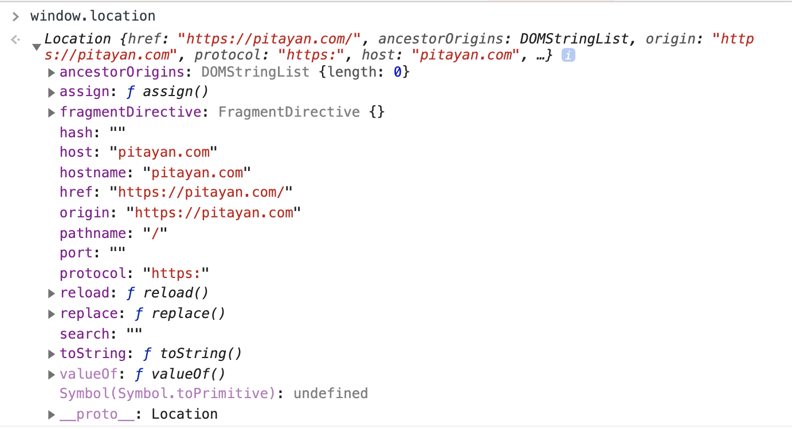

In this article, you will learn about the usage of document location object in javascript.


## 1. Basic Usage

### href
Using the `location` api is quite easy. What we use most frequently is perhaps the `href` property. This returns us the string url of the current working page.
```javascript
function getURL () {
  return window.location.href // https://pitayan.com/posts/document-location-javascript
}
```

`href` can also be altered in order to let browser redirect itself to a different page


```javascript
window.location.href = 'google.com' // redirect to google.com
```

### Reload page dynamically
With `reload` method, we could reload the current working page on demand.

```html
<button onclick="reloadPage()">reload page</button>

<script>
  function reloadPage () {
    window.location.reload(true)
  }
</script>
```

### Redirect page dynamically
With `assign` or `replace` method, we could go to another page effortlessly. If we use `replace` method, we cannot use browser back button to navigate to the previous page because the history record is overrided.

```html
<button onclick="goToGoogle()">go to google.com</button>

<script>
  function goToGoogle () {
    window.location.assign("https://google.com")
    // using replace
    // window.location.replace("https://google.com")
  }
</script>

```


## 2. window.location _vs_ document.location
You may noticed that both `window` and `document` have the `location` property. According to [W3C](https://html.spec.whatwg.org/multipage/browsers.html#dom-location), these two properties are bascically the same.

They both reference to the [Location](https://developer.mozilla.org/en-US/docs/Web/API/Document/location) Object. But in order to ensure the cross-browser compatibility, it's always preferrable to use `window.location` other than `document.location`.

If you open up [Chrome browser devtools](https://developers.google.com/web/tools/chrome-devtools) on a blank page, you can easily find out that the two properties `window.location` and `document.location` are equal.


## 3. Location Properties
### Example
If we take the [Pitayan top page](/) as an example, the `Location` Object will look like this.



### Brief introduction
In a `location` object, the current properties / apis are as follows.
- ***ancestorOrigins:*** for iframe usage
- ***hash:*** URL fragment includes leading "#" e.g. [#3. Location Properties](#3-location-properties)
- ***host:*** URL & Port e.g. localhost:8000
- ***hostname:*** URL e.g. www.pitayan.com
- ***href:*** complete URL [https://pitayan.com/posts/document-location-javascript](https://pitayan.com/posts/document-location-javascript)
- ***origin:*** URL scheme + URL e.g. https://www.pitayan.com
- ***pathname:*** path come after the host e.g. /posts/document-location-javascript
- ***port:*** server port e.g. 8000
- ***protocol:*** URL scheme e.g. `https` or `http`
- ***search:*** query string e.g. ?item=macbook


## References
- [https://www.tutorialrepublic.com/javascript-tutorial/javascript-window-location.php](https://www.tutorialrepublic.com/javascript-tutorial/javascript-window-location.php)
- [https://developer.mozilla.org/en-US/docs/Web/API/Document/location](https://developer.mozilla.org/en-US/docs/Web/API/Document/location)
- [https://developer.mozilla.org/en-US/docs/Web/API/Location](https://developer.mozilla.org/en-US/docs/Web/API/Location)
- [https://stackoverflow.com/questions/2430936/whats-the-difference-between-window-location-and-document-location-in-javascrip](https://stackoverflow.com/questions/2430936/whats-the-difference-between-window-location-and-document-location-in-javascrip)

