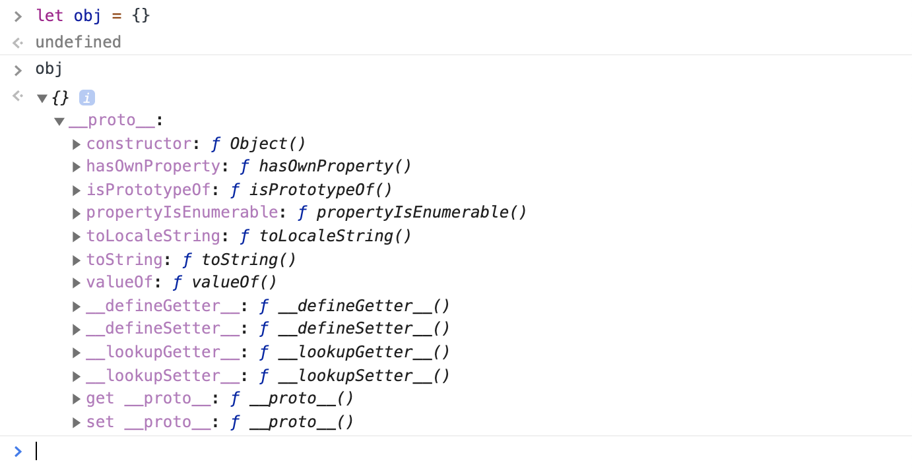

In this article, I'll show you how to handle Javascript "key-value" data type with its special "Array".

## Can you use "Array" as a "key-value" store?
Technically, **No**...

An [Array](https://developer.mozilla.org/en-US/docs/Glossary/array) is used for storing ordered list of data. This means that the key to each of its value is actually a number(string number).

```js
let arr = [0, 1, 2]

arr[0] // 0
arr[1] // 1
arr['2'] // 2
arr[2] === arr['2'] // true
```

As we all know, [Array](https://developer.mozilla.org/en-US/docs/Glossary/array) is also an [Object](https://developer.mozilla.org/en-US/docs/Web/JavaScript/Reference/Global_Objects/Object) in Javascript. Even though assigning a new property to an [Array](https://developer.mozilla.org/en-US/docs/Glossary/array) made it work. The methods within [Array](https://developer.mozilla.org/en-US/docs/Glossary/array) is not going work in the way you expected.

```js
let arr = []

arr.article = 'Javascript key-value store: is this unique among all programming languages?'
arr.url = 'https://pitayan.com/posts/javascript-key-value-array/'

// Now there should be an record in the arr but...
arr[0] // undefined
arr.length // 0

// aritcle is one property other than a record
arr['article'] // Javascript key-value store: is this unique among all programming languages?
arr['url'] // https://pitayan.com/posts/javascript-key-value-array/
```

## "Object" is all you want
There's no key value array in Javascript. Basically what you want with Javascript on storing the "key-value" is a data structure called [hashmap](https://www.w3schools.com/java/java_hashmap.asp). But Javascript doesn't have [hashmap](https://www.w3schools.com/java/java_hashmap.asp) itself. It uses a different data type [Object](https://developer.mozilla.org/en-US/docs/Web/JavaScript/Reference/Global_Objects/Object) which has the almost similar ability of a [hashmap](https://www.w3schools.com/java/java_hashmap.asp).

When you open up a console in Chrome browser and declare an `Object`, you'll get the following result: A variable defind by a pair of lovely curly brackets.


Of course you could assign some properties (key-value) in it. It's very simple. Just define the key and the value, you'll have your data store in a few seconds.

```js
// Define the key-value directly in Object
let obj = {
  url: 'https://pitayan.com/posts/javascript-key-value-array/'
}

// Additionally assign the value to a new key
obj.article: 'Javascript key-value store: is this unique among all programming languages?'
```

[Object](https://developer.mozilla.org/en-US/docs/Web/JavaScript/Reference/Global_Objects/Object) is quite a common and frequently used built-in Object. In order to meet some functionality demands, you may need some other built-in Objects like Map and Set (WeakMap WeakSet). They are used for data recombiniation and storage. Let's take a look.

## Other "key-value" store Objects in Javascript
Other than just using [Object](https://developer.mozilla.org/en-US/docs/Web/JavaScript/Reference/Global_Objects/Object) as a key-value store, you could also utilize the following Javascript standard built-in Objects.

- [***Map***](https://developer.mozilla.org/en-US/docs/Web/JavaScript/Reference/Global_Objects/Map):
  - a key-value pair collection
  - iterable
- [***WeakMap***](https://developer.mozilla.org/en-US/docs/Web/JavaScript/Reference/Global_Objects/WeakMap):
  - a reverted Map that stores key-value pairs but the "key" is the Object
  - All entries are Objects
  - Entries are weak references and retrievable by GC. No memory leak.
  - non-iterable
- [***Set***](https://developer.mozilla.org/en-US/docs/Web/JavaScript/Reference/Global_Objects/Set):
  - Unique, unordered
  - Key equals value. Or there's only value but no key
  - Iterable
- [***WeakSet***](https://developer.mozilla.org/en-US/docs/Web/JavaScript/Reference/Global_Objects/WeakSet):
  - All entries are Objects
  - Entries are weak references and retrievable by GC. Key can be any type.
  - non-iterable

### Map
Here are the methods/properties for manipulating the entries of a [Map](https://developer.mozilla.org/en-US/docs/Web/JavaScript/Reference/Global_Objects/Map)
- set(key, value): add a new element to the collection
- get(key, value): get an element from the collection
- size: the amount of the included elements
- delete(key): remove an element from the collection
- has(key): check if an element exists
- keys(): get all keys
- values(): get all values, same to keys()
- entries(): get all iterators of all key-value pairs
- forEach(): loop through all elements
- clear(): remove all elements from collection

```js
let map = new Map()

map.set(1, 1) // Map { 1 }
map.set(2, 2) // Map { 1, 2 }
map.get(1) // 1
map.get(2) // 2
map.size // 2
map.has(1) // true
map.delete(1) // true
map.keys() // Map Iterator [2]
map.values() // Map Iterator [2]
map.entries() // Map Iterator [[2, 2]]
map.forEach((d, k) => { ... })
map.clear() // undefined
```

### WeakMap
Here are the methods/properties for manipulating the entries of a [WeakMap](https://developer.mozilla.org/en-US/docs/Web/JavaScript/Reference/Global_Objects/WeakMap)
- set(key): add a new element to the collection
- get(key): get an element
- has(value): check if an element exists
- delete(value): remove an element from the collection

```js
let weakmap = new WeakMap()
let article = 'Javascript key-value store: is this unique among all programming languages?'
let url = 'https://pitayan.com/posts/javascript-key-value-array/'

weakmap.set(article, 'article') // WeakMap {{...} => "article"}
weakmap.set(url, 'url') // WeakMap {{...} => "url"}
weakmap.has(article) // true
weakmap.has(url) // true

weakmap.delete(article) // true

```

### Set
Here are the methods/properties for manipulating the entries of a [Set](https://developer.mozilla.org/en-US/docs/Web/JavaScript/Reference/Global_Objects/Set)
- size: the amount of the included elements
- add(value): add a new element to the collection
- delete(value): remove an element from the collection
- has(value): check if an element exists
- clear(): remove all elements from collection
- keys(): get all keys
- values(): get all values, same to keys() since [Set](https://developer.mozilla.org/en-US/docs/Web/JavaScript/Reference/Global_Objects/Set) only has values
- entries(): get all iterators of all key-value pairs
- forEach(): loop through all elements

```js
let set = new Set()

set.add(1) // Set { 1 }
set.add(2) // Set { 1, 2 }
set.size() // 1
set.has(1) // true
set.delete(1) // true
set.keys() // Set Iterator [2]
set.values() // Set Iterator [2]
set.entries() // Set Iterator [[2, 2]]
set.forEach((d, k) => { ... })
set.clear() // undefined
```

### WeakSet
Here are the methods/properties for manipulating the entries of a [WeakSet](https://developer.mozilla.org/en-US/docs/Web/JavaScript/Reference/Global_Objects/WeakSet)
- add(value): add a new element to the collection
- delete(value): remove an element from the collection
- has(value): check if an element exists


```js
let weakset = new WeakSet()
let article = {
  name: 'Javascript key-value store: is this unique among all programming languages?'
}
let url = {
  address: 'https://pitayan.com/posts/javascript-key-value-array/'
}

weakset.add(article) // WeakSet {{...}}
weakset.add(url) // WeakSet {{...}, {...}}
weakset.has(url) // true
weakset.delete(article) // true
weakset.has(article) // false
```

## References
- [https://developer.mozilla.org/en-US/docs/Web/JavaScript/Reference/Global_Objects](https://developer.mozilla.org/en-US/docs/Web/JavaScript/Reference/Global_Objects)
- [https://developer.mozilla.org/en-US/docs/Web/JavaScript/Reference/Global_Objects/Map](https://developer.mozilla.org/en-US/docs/Web/JavaScript/Reference/Global_Objects/Map)
- [https://developer.mozilla.org/en-US/docs/Web/JavaScript/Reference/Global_Objects/WeakMap](https://developer.mozilla.org/en-US/docs/Web/JavaScript/Reference/Global_Objects/WeakMap)
- [https://developer.mozilla.org/en-US/docs/Web/JavaScript/Reference/Global_Objects/Set](https://developer.mozilla.org/en-US/docs/Web/JavaScript/Reference/Global_Objects/Set)
- [https://developer.mozilla.org/en-US/docs/Web/JavaScript/Reference/Global_Objects/WeakSet](https://developer.mozilla.org/en-US/docs/Web/JavaScript/Reference/Global_Objects/WeakSet)
- [https://juejin.im/post/5d39d14c518825625337f84e](https://juejin.im/post/5d39d14c518825625337f84e)
- [https://juejin.im/post/5e1d2717e51d4557e97b109b](https://juejin.im/post/5e1d2717e51d4557e97b109b)
