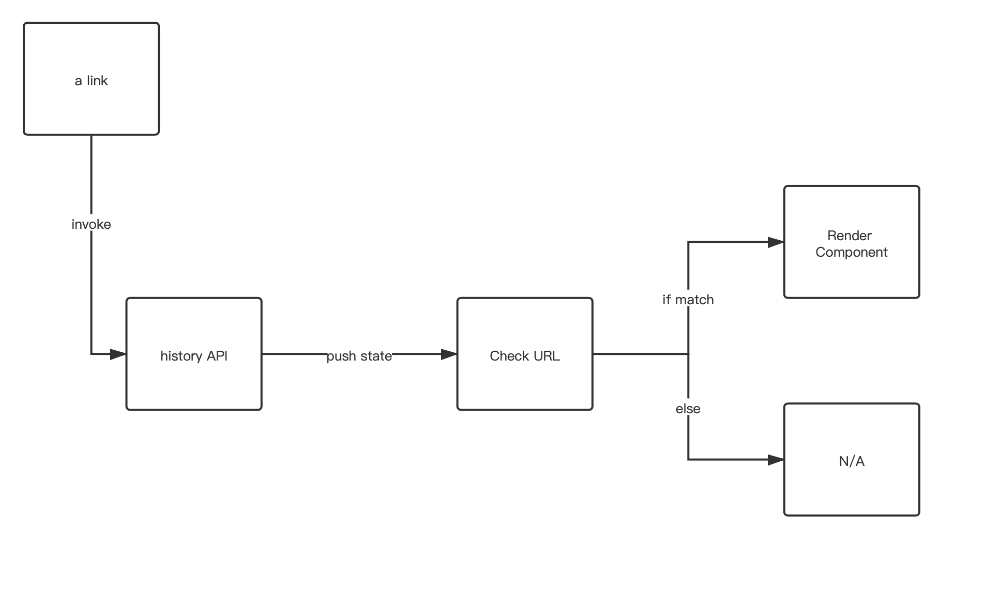
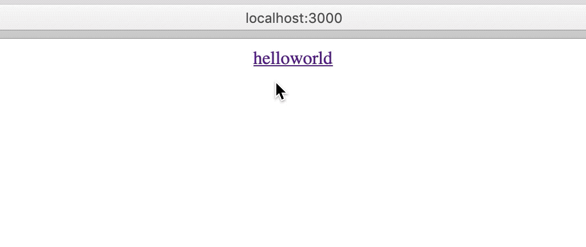

## Drill down

Recently, I started drilling down to the bottom of those tools and frameworks' source code in order to enlighten me on software/system design (as a pretentious developer).

I think you've seen that there are many libraries which kernel are with only a few lines of code on Github (e.g. Reselect), and they are starred 1000+. (Actually, react-router isn't one from them though) Thus, I started to rethink myself: Isn't it too simple? I could even make one myself (not being self-delusional but arrogant :D). But after reviewing their source code, the fact proves me wrong: I'm young and foolish. Simple things are difficult to make.

After drilling down the [react-router](https://github.com/ReactTraining/react-router) repository, I'd like to share some of the key points of how they made the router possible. So in this article, I'll demonstrate creating a sweet homemade react-router from scratch.

## Basic Concepts

A very rudimentary router behavior would be:

- When a user clicks on the `<a>` tag, the browser will redirect to the target page without reload

In terms with the requirement above, let's imagine one simple solution to react to the URL change.

- Use [history API](https://developer.mozilla.org/en/docs/Web/API/History_API) to handle page redirects programmatically
- Use a "link" component (`<a>` tag) to intercept redirection click
- Use a wrapper component to conditionally render contents by judging the URL

(Can't be any simpler)



In [react-router](https://github.com/ReactTraining/react-router), there are 5 basic APIs:

- **BrowserRouter**: exposes [history API](https://developer.mozilla.org/en/docs/Web/API/History_API) to its children components
- **Router**: child component of **BrowserRouter** (and other types of router) which will provide
- **Link**: redirects without reload
- **Route**: decides wether to render
- **RouterContext**: provides URL related context including [history API](https://developer.mozilla.org/en/docs/Web/API/History_API)

With these components above, I will make a mini project: hello world.

```tsx
// It will jump between /hello and /world
<BrowserRouter>
  <Link to="/hello">hello</Link>
  <Link to="/world">world</Link>

  <Route path="/hello" render={() => <div>hello</div>} />
  <Route path="/world" render={() => <div>world</div>} />
</BrowserRouter>
```

## Example repository

I created a repo with [create-react-app](https://github.com/facebook/create-react-app).

Repo url: https://github.com/daiyanze/react-router-tear-down

The folder structure looks like this

```sh
- public
- src
  - router/ # sweet homemade router
    ...
  - App.js
  - index.js
- .gitignore
- LICENSE
- package.json
- README.md
```

#### 1.Clone

```sh
$ git clone https://github.com/daiyanze/react-router-tear-down
$ cd react-router-tear-down
```

#### 2. Start the server

```sh
# start the server
$ yarn & yarn start

# use npm if you prefer
$ npm i & npm run start
```


🎉 My React is alive!

#### 3. Simplify
I think I don't quite need styling sheets and service worker. So I'll remove these fancy stuff.
```sh
rm -f src/App.css
rm -f src/index.css
rm -f src/logo.svg
rm -f src/serviceWorker.js
```

And stuff in my little "hello world".

`./src/App.js`
```tsx
import React from 'react'

function App() {
  return (
    <div></div>
  );
}

export default App
```

`./src/index.js`
```tsx
import React from 'react'
import ReactDOM from 'react-dom'
import App from './App'

ReactDOM.render(
  <React.StrictMode>
    <App />
  </React.StrictMode>,
  document.getElementById('root')
);

```

Now the page is completely blank. Let me create each of the components to bring it back to life.

## Start scratching

Now I will start implementing these files under `./src/router` folder.

```
src/router/
	RouterContext.js
	Route.js
	Router.js
	BrowserRouter.js
	Link.js
```

#### RouterContext

In order to let all of the components access some properties, I need to create a context to provide the URL related objects for the decendant components.

 `./src/router/RouterContext.js`

```tsx
import React from "react"

export const RouterContext = React.createContext()
```

As simple as that!

#### Route

The **Route** will render the content once the `path` matches the current URL.

Properties:

- **path** (string): The matching URL
- **children** (Function): The children component that ignores the `path` matching
- **render** (Function): Similar to **children** but considers `path` matching
- **component** (Component): Invokes `React.cloneElement`

For the component properties, there's a rendering order.

```txt
children > component > render
```

This means when all of the above props come up in the same component, only `children` will render. If `children` doesn't exist, then `component` will take effect. Else then `render`...

```tsx
render () {
	return (
    <Route
  		children={ChildrenComponents} // This will be rendered
      component={Component} // Nope
      render={() => Component} // Nope
  	/>
  )
}
```

 `./src/router/Route.js`

```tsx
import React, { Component } from "react"
import { RouterContext } from "./RouterContext"
import { matchPath } from "react-router" // allow me to borrow its beautiful function

export default class Route extends Component {
  render() {
    return (
      <RouterContext.Consumer>
        {
          context => {
            const { location } = context

            const { path, children, component, render, computedMatch } = this.props

            const match = computedMatch
              ? computedMatch
              : path ? matchPath(location.pathname, this.props) : context.match

            const props = {
              ...context,
              location,
              match
            }

            // If match
            // then children > component > render
            // else
            // children | null
            return (
              // Need to use context again to ensure the provider passes the updated props
              <RouterContext.Provider value={props}>
                {
                  match
                    ? children // Children comes first
                      ? (typeof children === "function" ? children(props) : children)
                      : (component // Component comes second
                         ? React.createElement(component, props)
                         : (render ? render(props) : null)) // Render comes last
                    : (typeof children === "function" ? children(props) : null)
                }
              </RouterContext.Provider>
            )
          }
        }
      </RouterContext.Consumer>
    )
  }
}
```

#### BrowserRouter

The **BrowserRouter** uses HTML5 [history API](https://developer.mozilla.org/en/docs/Web/API/History_API) (`pushState` `replaceState` `popState` etc.) to sync up the UI and URL.

All of those components that needs the [history](https://developer.mozilla.org/en/docs/Web/API/History_API) context have to stay as **BrowserRouter** children component. Otherwise, it will throw errors.

Properties:

- **basename** (string): The base of your app's entire URL

  ```html
  <!-- For instance, if "/app" is our URL base, "/app" will be prepended to all URLs -->
  <BrowserRouter basename="/app">
  	<Link to="/somewhere">
      Take me to somewhere
    </Link>
  </BrowserRouter>

  <!-- The above will be compiled to -->
  <a href="/app/somewhere">Take me to somewhere</a>
  ```

`./src/router/BrowserRouter.js`

```tsx
import React, { Component } from "react"
import { createBrowserHistory } from "history"
import Router from "./Router"

export default class BrowserRouter extends Component {
  constructor(props) {
    super(props)
    this.history = createBrowserHistory()
  }

  render() {
    return <Router children={this.props.children} history={this.history} />
  }
}
```

#### Router
In [react-router](https://github.com/ReactTraining/react-router), **Router** component is just a context provider which will listen to `location` changes. It absorbs the [history](https://developer.mozilla.org/en/docs/Web/API/History_API) passed from **BrowserRouter** as its state.

`./src/router/Router.js`
```tsx
import React, { Component } from "react"
import { RouterContext } from "./RouterContext"

export default class Router extends Component {
  // Check root path
  static computeRootMatch (pathname) {
    return {
      path: "/",
      url: "/",
      params: {},
      isExact: pathname === "/"
    }
  }

  constructor (props) {
    super(props)

    this.state = {
      location: props.history.location
    }

  }

  componentDidMount () {
    // update location when url changes
    this.props.history.listen(({ location }) => {
      this.setState({ location })
    })
  }

  render () {
    const { history, children } = this.props

    return (
      // Provide `history` `location` `match` to children components
      <RouterContext.Provider
        value={{
          history,
          location: this.state.location,
          match: Router.computeRootMatch(this.state.location.pathname)
        }}>
        { children }
      </RouterContext.Provider>
    )
  }
}
```

#### Link
All I need to do is to intercept the click event and use the [history](https://developer.mozilla.org/en/docs/Web/API/History_API) API to change the url.

`./src/router/Link.js`
```tsx
import React, { Component } from "react"
import { RouterContext } from "./RouterContext"

export default class Link extends Component {
  static contextType = RouterContext

  handleClick = e => {
    e.preventDefault()
    // Push the target location to history
    this.context.history.push(this.props.to)
  }

  render() {
    const { to, children, ...others } = this.props
    return (
      <a onClick={this.handleClick} href={to} {...others}>
        { children }
      </a>
    )
  }
}
```

## All components are done
Em... still nothing come out.

I see. I need to add routes and links to `App.js`.

`./src/App.js`
```tsx
import React from 'react'

function App() {
  return (
    // Center the elements
    <div style={{ textAlign: "center", width: "100%" }}>
      <BrowserRouter>
        <Link to="/hello">hello</Link>
        <Link to="/world">world</Link>

        <Route path="/hello" render={() => <div>hello</div>} />
        <Route path="/world" render={() => <div>world</div>} />
      </BrowserRouter>
    </div>
  );
}

export default App
```
Now my little "hello world" is done. Let's see the result.



Yay! It works!

## Conclusion
[react-router](https://github.com/ReactTraining/react-router) indeed is a very very solid middleware for [React](https://reactjs.org). After exploring the whole project, I can see that there are a lot of great efforts to make it as simple as possible. What I created myself was just a very basic stuff which is based on [react-router v1.0.0](https://github.com/ReactTraining/react-router/tree/v1.0.0) and it is only an example to help me understand how router works. Gotta keeps study and exploring so that I could improve and become a better engineer.


## References
- [https://reactrouter.com/](https://reactrouter.com/)
- [https://github.com/ReactTraining/react-router](https://github.com/ReactTraining/react-router)
- [https://knowbody.github.io/react-router-docs/](https://knowbody.github.io/react-router-docs/)
- [https://stackoverflow.com/questions/42123261/programmatically-navigate-using-react-router-v4](https://stackoverflow.com/questions/42123261/programmatically-navigate-using-react-router-v4)
- [https://www.kirupa.com/react/creating_single_page_app_react_using_react_router.htm](https://www.kirupa.com/react/creating_single_page_app_react_using_react_router.htm)
- [https://reactjs.net/features/react-router.html](https://reactjs.net/features/react-router.html)
