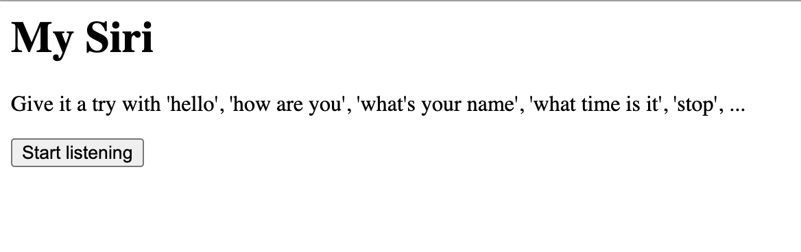
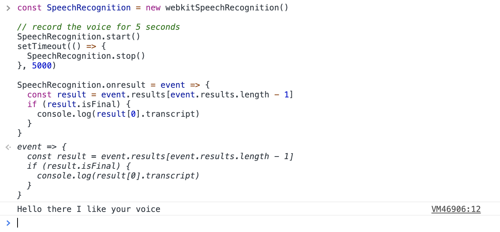
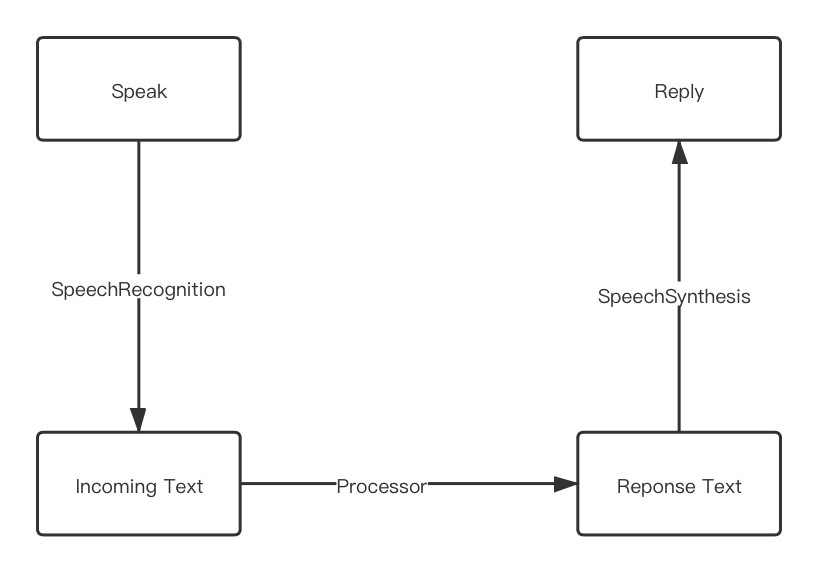
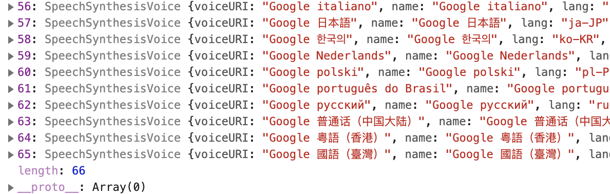

Just a few days ago, I saw someone ([nhudinhtuan](https://github.com/nhudinhtuan)) made a voice recognition helper with Chrome experimental [WebSpeechAPI](https://developer.mozilla.org/en-US/docs/Web/API/Web_Speech_API). The helper app is going to listen to human voice and turn it into plain text. After all that it will open up a new tab page of Google Search.

Give it try via the link [here](https://nhudinhtuan.github.io/mysiri/). (Only supports Chrome / new Edge browser)



I think this is quite fun to make some interesting project with API that is hardly ever used. So I decided to make an upgraded version of this voice assistant. My version is nothing special but it's implemented with [Vue.js](https://vuejs.org/) and its new [composition api](https://composition-api.vuejs.org/).

In this article, I'll walk you through the process of creating this sexy voice assistant.

**TLDR;**

## Demo My Voice Assistant
> Talk is cheap, let me show you my work

Hold the button "Hold to Listen" and try with some of the following sentenses (Only works on Chrome/Edge79+)

- *Hello!*
- *Hi!*
- *What is your name?*
- *I love you*
- *Google search: <something_you_want_to_query>*
- *...naked...*


<div class="gatsby-resp-iframe-wrapper mark-w-2l w-full mb-8" style="padding-bottom: 56.5%; position: relative; height: 0px; overflow: hidden;">
  <iframe
    style="position: absolute; top: 0px; left: 0px; width: 100%; height: 100%;"
    scrolling="no"
    title="Voice Assistant"
    src="https://codepen.io/daiyanze/embed/zYpJwmN?default-tab=result"
    frameborder="no"
    loading="lazy"
    allowtransparency="true"
    allowfullscreen="true"
    allow="microphone *">
    See the Pen <a href="https://codepen.io/daiyanze/pen/zYpJwmN">
    Voice Assistant</a> by Yanze Dai (<a href="https://codepen.io/daiyanze">@daiyanze</a>)
    on <a href="https://codepen.io">CodePen</a>.
  </iframe>
</div>

You can also change the speaker voice from the select list on the right side. Currently, there are **60** more voices supported on my Mac. Personally, I think **Karen** was one of the Smoothest robot English speaker.

I guess that you must have tried speaking some other stuffs to the voice assistant. But I'm really sorry to tell you that it could only reply you properly when your speech matches the above examples. Otherwise, it cannot understand. (It's a prototype though)

## How it works
Let's take a quick look at the voice handling APIs used in the voice assistant. These are the key figures of making the voice assistant "sexy".

#### APIs

##### [SpeechRecognition](https://developer.mozilla.org/en-US/docs/Web/API/SpeechRecognition): Recognize your voice and turn it into text

```javascript
// Needs the `webkit` prefix due to lacking of browsers support
var recognition = webkitSpeechRecognition()

// Set to `true` to listen to voices
// continuously and return multiple results.
recognition.continuous = true;

// Start recognition
recognition.start()

// Stop recognition
recognition.stop()

// Handle the result
recognition.onresult = function (event) {
  console.log(event)
}
```

##### [SpeechSynthesis](https://developer.mozilla.org/en-US/docs/Web/API/SpeechSynthesis): Get all supported voices and speak out loud

```javascript
var Synth = window.speechSynthesis

// Speak out loud
Synth.speak(utterThis)

// Cancel speaking
Synth.cancel()

// Pause speaking
Synth.pause()

// Resume speaking
Synth.resume()

// List out voices supported by the OS
Synth.getVoices()
```

##### [SpeechSynthesisUtterance](https://developer.mozilla.org/en-US/docs/Web/API/SpeechSynthesisUtterance): Speech request Object

```javascript
var utterThis = new SpeechSynthesisUtterance()

// Utterance only has properties
// The spoken language
utterThis.lang
// The tone or the pitch or voice, ranges from 0 to 2.
// The higher the younger :D
utterThis.pitch
// Speaking speed, ranges from 0.1 to 10
utterThis.rate
// The content to be spoken
utterThis.text
// Speaker's voice. It's an Object
utterThis.voice
// Speaker's volume
utterThis.volume
```

Actually these APIs are created for people who need to use voices to control web pages other than providing as a chat bot. In another word, when your team has completed mosted of the robust features. Then it'd be a good timing to level up the accessibility of your web app to help those people who need voice controls.

#### Usage Examples
You can give it a try in the Chrome console by **copying** & **pasting** the code below.

1. Voice speaker: The following code will say "hello world" out loud.

    ```javascript
    const utterThis = new SpeechSynthesisUtterance("Hello world")

    speechSynthesis.speak(utterThis)
    ```

2. Voice to text: The following code will turn your voice into text.

    ```javascript
    const SpeechRecognition = new webkitSpeechRecognition()

    // record the voice for 5 seconds
    SpeechRecognition.start()
    setTimeout(() => {
      SpeechRecognition.stop()
    }, 5000)

    SpeechRecognition.onresult = event => {
      const result = event.results[event.results.length - 1]
      if (result.isFinal) {
        console.log(result[0].transcript)
      }
    }
    ```
    (Here is the result)
    


## The Design
After some practices over these [APIs](#apis), I was able to create a voice repeater with the [example codes](#usage-examples) above. But we need another text processor to receive my messages and return the proper response.

#### Workflow


Quite simple, isn't it?

Workflow in a brief word, "**speak**"&nbsp;"**process**" and "**reply**".

#### Controls
The design was simple and easy to start with. Now we need some triggers that enables/disables listening to voices. So here comes with two "buttons":

- <button class="text-sm font-semibold text-white px-4 py-px bg-gray-600 rounded-sm">Hold to Listen</button> Hold this button to record voices
- <button class="text-sm font-semibold text-white px-4 py-px bg-gray-600 rounded-sm">Reset</button> Click this button to cancel everything and reset all states

I hope that I could also make the voices "visible" in order to have an intuitive history of my chats. This means I need a **message-box** like this:

<pre class="border border-solid border-gray-300 p-2 leading-6 rounded-md">
Me: Hello!
You: Hi!
</pre>

Okay... I've done all of the imaginations for my voice assistant. Now we can start coding.

## Dive Into Coding...
#### HTML Template
I'm using [Vue.js](https://vuejs.org/) as my frontend framework so that the appearance of the voice assitant can be prototyped very easily. In terms with the design I made, I figured out a very rudimentary template like the following.

```html
<template>
  <div>
    <pre></pre>
    <button>Hold to Listen</button>
    <button>Reset</button>
  </div>
</template>
```

#### Controller
In order to enable the controls, I added some functions and props to the template. Now the template looks like:

```html
<template>
  <div>
    <pre class="message-box" v-html="context"></pre>
    <button
      class="button-control"
      @mousedown="listen(true)"
      @mouseup="listen(false)">
      Hold to Listen
    </button>
    <button class="button-control" @click="reset">Reset</button>
  </div>
</template>
```

As for the logics part, I used the [vue-composition-api](https://composition-api.vuejs.org/) to return the properties for the template. These codes below are enough to let go of the errors meanwhile enable the buttons. Right now, it's just a skeleton.

```html
<script>
import { toRefs, reactive } from 'vue-composition-api'

export default {
  setup () {
    const state = reactive({
      context: 'Hello!'
    })

    const listen = start => {}

    const reset = () => {}

    return {
      ...toRefs(state),
      listen
    }
  }
}
</script>
```

#### Recognize the Voice
The target is quite clear:
> To let browser convert my voice to text.

I'll use the `listen` function to control the voice recongnition. And setup a callback function to handle the recognition result.

```js
const SpeechRecognition = window.webkitSpeechRecognition && new window.webkitSpeechRecognition()
SpeechRecognition && (SpeechRecognition.interimResults = true)

const listen = start => {
  if (!SpeechRecognition) return

  if (start) {
    SpeechRecognition.start()
  } else {
    SpeechRecognition.stop()
  }
}

const reset = () => {
  if (!SpeechRecognition) return

  state.context = '<b>' + state.name + '</b>' + ': Hi, my hero!'
  speechSynthesis.cancel()
}

SpeechRecognition.onresult = event => {
  const result = event.results[event.results.length - 1]

  if (result.isFinal) {
    state.context = result[0].transcript
  }
}
```

#### Create reply text
I'm not creating an almighty AI chatbot (That's too difficult for me) but something enough to deal with text. In short, my idea is to create a processor which will generate reply text based on what I spoke.

I'll just make the function name `process`. With some `if else` statement, we are done with it.
```javascript
const process = (msg, voice) => {
  const content = msg.toLowerCase()

  if (/^google search/g.test(content)) {
    const url = `https://google.com/search?q=${msg.replace('Google search ', '')}`
    window.open(url, '_blank')
    return `Base on your query, I found some search results on Google`
  } else if (/your name/g.test(content)) {
    return `My name is ${voice.name}.`
  } else if (/(hello|hi)/g.test(content)) {
    return 'Hi! Nice to meet you!'
  } else if (/love you/g.test(content)) {
    return 'I love you too. And I\'ll love you forever!'
  } else if (/(naked|nude|tits|breast|butt|ass|shit|dick|pussy|asshole)/g.test(content)) {
    return 'I know I love you but can you show some politeness in front of a lady?'
  }

  return 'Sorry, my sweetheart. I don\'t understand. Could you try something else?'
}
```

Give it a small test: when I say "I love you".

```javascript
process('I love you')
// I love you too. And I'll love you forever!
```

#### Set up a "sexy" voice
There are actually a lot of different speaking voices stashed in our OS. [SpeechSynthesis](https://developer.mozilla.org/en-US/docs/Web/API/SpeechSynthesis) API allows us to use these voices to replace the default.

```javascript
var voices = window.speechSynthesis.getVoices()
```

Take my Mac as an example, there are **66** voices to choose from.




`speechSynthesis.getVoices` is unpredictable, have to make sure it returns an non-empty list. So I made another async function to resolve the list by check it insistantly.

```javascript
const getVoices = async (window) => {
  let id, res

  await new Promise((resolve, reject) => {
    id = setInterval(() => {
      res = window.speechSynthesis.getVoices()
      if (res.length !== 0) {
        resolve(res)
        clearInterval(id)
      }
    }, 10)
  })

  return res
}
```

To make sure the voice is "sexy" enough, I've tested all of the voices. For a female voice, I choose **"Karen"**.


2 upvotes for **"Karen"**:
- She speaks smooth enough
- Tuning up a bit of the pitch will make her voice cuter

```javascript
onMounted(async () => {
  const voices = await getVoices()
  const voiceKaren = voices[17]
})
```

#### Speak out loud
I've got all the resources I need. Then the next step would be to use the response processor to create text, and allow the speechSpeaker to display the audio. The timing of speaking is right after the voice recognition.

```javascript
onMounted(async () => {
  const voices = await getVoices()
  const voiceKaren = voices[17]

  // The final function to speak out the response text
  const speechSpeaker = (text, voice) => {
    utterThis.text = text
    utterThis.voice = voice
    utterThis.pitch = 1.4 // This sounds better
    utterThis.lang = voice.lang
    window.speechSynthesis.speak(utterThis)
  }

  SpeechRecognition.onresult = event => {
    const result = event.results[event.results.length - 1]

    if (result.isFinal) {
      state.context = '\n<b>Me:</b> ' + result[0].transcript

      const reply = process(result[0].transcript, voice)

      state.context += '\n<b>' + voice.name + '</b>: ' + reply

      speechSpeaker(reply, voiceKaren)
    }
  }
})
```

After a few tests, it feels weird to hear the response voice immediately after I speak. So it'd be more natural to delay the response a little bit by 600ms.

```javascript
SpeechRecognition.onresult = event => {
    const result = event.results[event.results.length - 1]

    if (result.isFinal) {
      state.context = '\n<b>Me:</b> ' + result[0].transcript

      const reply = process(result[0].transcript, voice)

      setTimeout(() => {
        state.context += '\n<b>' + voice.name + '</b>: ' + reply

        speechSpeaker(reply, voiceKaren)
      }, 600)
    }
  }
```

#### Styling
I used [Tailwindcss](https://tailwindcss.com/) to stylish my voice assistant because it offers more customizability.

The `<style></style>` looks like this:

```sass
.button-control {
  @apply font-semibold;
  @apply px-4 py-2;
  @apply mr-2 mb-2;
  @apply bg-gray-600;
  @apply rounded-sm;
  @apply shadow-2xl;
  @apply text-white;

  &:focus {
    @apply outline-none;
  }

  &:active {
    @apply bg-gray-700;
    @apply shadow-none;
  }
}

.message-box {
  @apply relative;
  @apply h-48;
  @apply overflow-y-scroll;
  @apply rounded-sm;
  @apply border border-solid border-gray-300;
  @apply p-2;
  @apply mb-2;
  @apply leading-6;
}

.voice-options {
  @apply font-semibold;
  @apply bg-gray-100;
  @apply px-2 py-1;
  @apply mr-2 mb-2;
  @apply rounded-sm;
  @apply border-2 border-solid border-gray-100;
  @apply shadow-md;

  &:focus {
    @apply outline-none;
  }
}
```

#### UX optimization
Now I got 2 good ideas to make it better:
- Allow selecting voice from a dropdown list
- Let the message-box scrollbar follow the latest message

With these 2 ideas, my final prototype of "sexy" voice assistant came out.

Let me just show you the full source code of it:

```html
<template>
  <div class="mx-auto w-full">
    <pre class="message-box" v-html="context" ref="messageBox"></pre>
    <button class="button-control" @mousedown="listen(true)" @mouseup="listen(false)">Hold to Listen</button>
    <button class="button-control" @click="reset">Reset</button>
    <select class="voice-options" v-model="activeVoiceIdx">
      <option :key="key" :value="key" :selected="key === activeVoiceIdx" v-for="(val, key) in voices">
        {{ val.name }} ({{ val.lang }})
      </option>
    </select>
  </div>
</template>
```
```javascript
<script>
import { onMounted, reactive, toRefs, ref } from '@vue/composition-api'

export default {
  setup (_, { root }) {
    const getVoices = async (window) => {
      let id, res

      await new Promise((resolve, reject) => {
        id = setInterval(() => {
          res = window.speechSynthesis.getVoices()
          if (res.length !== 0) {
            resolve(res)
            clearInterval(id)
          }
        }, 10)
      })

      return res
    }

    const process = (msg, voice) => {
      const content = msg.toLowerCase()

      if (/^google search/g.test(content)) {
        const url = `https://google.com/search?q=${msg.replace('Google search ', '')}`
        window.open(url, '_blank')
        return `Base on your query, I found some search results on Google`
      } else if (/your name/g.test(content)) {
        return `My name is ${voice.name}.`
      } else if (/(hello|hi)/g.test(content)) {
        return 'Hi! Nice to meet you!'
      } else if (/love you/g.test(content)) {
        return 'I love you too. And I\'ll love you forever!'
      } else if (/(naked|nude|tits|breast|butt|ass|shit|dick|pussy|asshole)/g.test(content)) {
        return 'I know I love you but can you show some politeness in front of a lady?'
      }

      return 'Sorry, my sweetheart. I don\'t understand. Could you try something else?'
    }

    const state = reactive({
      name: '',
      context: 'Sorry, your browser doesn\'t support SpeechRecognition. Please use Chrome / Edge79+ instead.',
      voices: [],
      activeVoiceIdx: 17
    })

    const messageBox = ref(null)

    const SpeechRecognition = window.webkitSpeechRecognition && new window.webkitSpeechRecognition()
    SpeechRecognition && (SpeechRecognition.interimResults = true)

    const listen = start => {
      if (!SpeechRecognition) return

      if (start) {
        SpeechRecognition.start()
      } else {
        SpeechRecognition.stop()
      }
    }

    const reset = () => {
      if (!SpeechRecognition) return

      state.context = '<b>' + state.name + '</b>' + ': Hi, my hero!'
      speechSynthesis.cancel()
    }

    onMounted(async () => {

      if (!window.webkitSpeechRecognition) return

      state.voices = await getVoices(window)
      state.name = state.voices[state.activeVoiceIdx].name
      state.context = '<b>' + state.name + '</b>' + ': Hi, my hero!'

      const utterThis = new window.SpeechSynthesisUtterance()

      const speechSpeaker = (text, voice) => {
        utterThis.text = text
        utterThis.voice = voice
        utterThis.pitch = 1.4
        utterThis.lang = voice.lang
        window.speechSynthesis.speak(utterThis)
      }

      SpeechRecognition.onresult = event => {
        const result = event.results[event.results.length - 1]

        if (result.isFinal) {
          state.context += '\n<b>Me:</b> ' + result[0].transcript

          const voice = state.voices[state.activeVoiceIdx]
          const reply = process(result[0].transcript, voice)
          root.$nextTick(() => {
            messageBox.value.scrollTop = messageBox.value.scrollHeight
          })

          setTimeout(() => {
            state.context += '\n<b>' + voice.name + '</b>: ' + reply

            root.$nextTick(() => {
              messageBox.value.scrollTop = messageBox.value.scrollHeight
            })

            speechSpeaker(reply, voice)
          }, 600)
        }
      }

    })

    return {
      ...toRefs(state),
      listen,
      reset,
      messageBox
    }
  }
}
</script>
```

```sass
<style lang="postcss" scoped>
.button-control {
  @apply font-semibold;
  @apply px-4 py-2;
  @apply mr-2 mb-2;
  @apply bg-gray-600;
  @apply rounded-sm;
  @apply shadow-2xl;
  @apply text-white;

  &:focus {
    @apply outline-none;
  }

  &:active {
    @apply bg-gray-700;
    @apply shadow-none;
  }
}

.message-box {
  @apply relative;
  @apply h-48;
  @apply overflow-y-scroll;
  @apply rounded-sm;
  @apply border border-solid border-gray-300;
  @apply p-2;
  @apply mb-2;
  @apply leading-6;
}

.voice-options {
  @apply font-semibold;
  @apply bg-gray-100;
  @apply px-2 py-1;
  @apply mr-2 mb-2;
  @apply rounded-sm;
  @apply border-2 border-solid border-gray-100;
  @apply shadow-md;

  &:focus {
    @apply outline-none;
  }
}
</style>

```

You can also find the source on my Github:
[https://github.com/daiyanze/sexy-voice-assistant](https://github.com/daiyanze/sexy-voice-assistant)

## Reference
- [https://developer.mozilla.org/en-US/docs/Web/API/SpeechSynthesisUtterance](https://developer.mozilla.org/en-US/docs/Web/API/SpeechSynthesisUtterance)
- [https://developer.mozilla.org/en-US/docs/Web/API/SpeechSynthesis](https://developer.mozilla.org/en-US/docs/Web/API/SpeechSynthesis)
- [https://developer.mozilla.org/en-US/docs/Web/API/SpeechRecognition](https://developer.mozilla.org/en-US/docs/Web/API/SpeechRecognition)
- [https://github.com/nhudinhtuan](https://github.com/nhudinhtuan)
