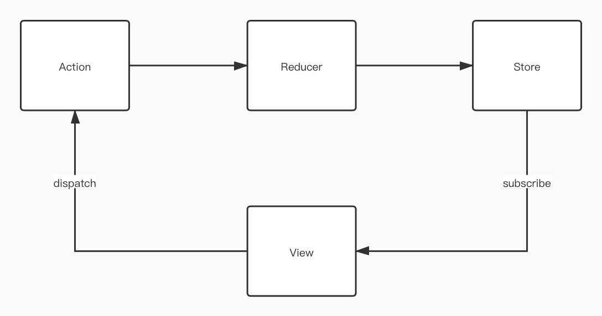
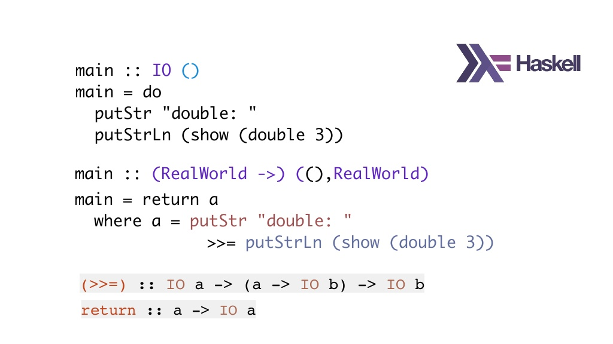
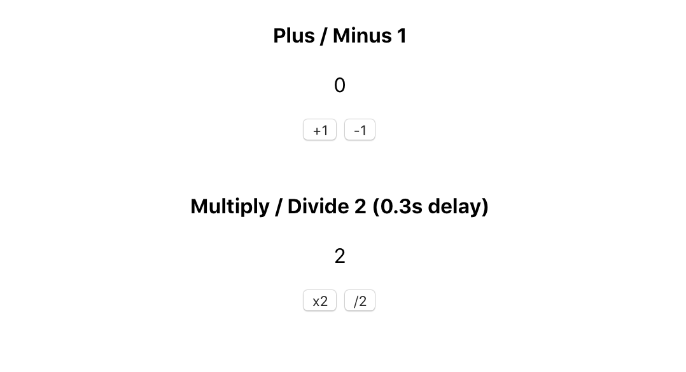

Before I set my eyes on the Redux source code, I naively thought OOP is superior than FP(Functional Programming) as a programming paradigm. But this is not right. As we know that FP is dedicated to forming a easy to understand and clear workflow without those obscure abstracted objects and relations. It's much closer to human's procedural mode of thinking.

Now `React` has already got hooks which can handle the "states" properly event without [Redux](https://redux.js.org). The demand for [Redux](https://redux.js.org) could be declining but its code base is still worth learning. Especially for those who wants to enlighten themselves in functional programming. So, I guess it's never a bad idea to learn from a good example even though it is "obsolete" (not at all).

When I started reading the [Redux](https://redux.js.org) source code, I immediately felt the power of this unfamiliar usage of my familiar programming language. It feels like exploring an acient cave with a torch lighting up the paintings and found the great secret.

In order to know more about what Redux benefits from FP, I researched the [Redux](https://redux.js.org) source code and created a mini version of it.

> Never be afraid of reinventing the wheel.

## Recap How Redux Works

There are 4 basic key points for [Redux](https://redux.js.org):

1. Create a store for data and let the view subscribe to it
2. The view dispatches an action to submit the changs
3. The reducer changes the state based on the action type
4. Finally return the new state and triggers the view to change

This is the classic diagram explaining how [Redux](https://redux.js.org) works:



From the diagram above, it's easy to find the keywords: `action` `store` `reducer` `view` `subscribe` and `dispatch`. And the next is to handle the relations among these keywords.


## Redux Approach Comparison: FP vs OOP

Example usage of [Redux](https://redux.js.org)

```js
const store = createStore(
  combineReducers({
    one: oneReducer,
    two: twoReducer
  }),
  applyMiddleware(ReduxThunk, ReduxLogger)
);
```

Imagine if we do this in OOP, it may look like this:

(The following is just my imagination. Not how older [Redux](https://redux.js.org) behaves)

```js
const store = new Store()
store.setReducers({
  one: oneReducer,
  two: twoReducer
})
store.setMiddlewares({
  ReduxThunk,
  ReduxLogger
})
```

So, what are the differences? Both are good approaches IMO.

FP does a good job on combining the functions together without side-effects. The return value is consistent which made the program returnings foreseeable during or after the execution.

OOP made a solid structure which defined all the attributes a data model should contain. It makes it easy to modify or configure the data model.

In [Redux](https://redux.js.org), the `reduers` and `middlewares` are usually defined only once. It means, we don't need the ability to update these properties and we don't hope them to be altered during the runtime. As for FP approach, it utilizes the `closure` technique that kills the possbility of exposing the internal properties. With some fantastic FP techniques (curry, compose, pipe), it's even making the program much more human-readable than OOP.

I would say FP should be the best fit for such scenario. Of course, the FP I'm talking about here is far from the real functional programming like Haskell. But at least the idea of utilizing FP techniques in Javascript is something to follow.




## Wonderful Redux FP Design

In Redux, there is no class at all (In the earlier versions, it was once based on `Class`). All of its core APIs return either value or function (function factory). And this is exactly what FP expects a function to behave:

> Pure with no side effects.

- **createStore**: returns new `Object` { getState, dispatch, subscribe }
- **combineReducers**: returns new `Function`
- **applyMiddleware**: returns new `Function`

To explain the [Redux](https://redux.js.org) design in an easy way, I implemented only the very core part of the APIs above. Since the latest version's core concept hasn't changed much, I wrote the source code based on very primitive version of [Redux v1.0.1](https://github.com/reduxjs/redux/tree/v1.0.1/src). Because I believe the very first related version would be the most comprehensive one to look at.

Let's have a look.

#### createStore

`createStore` defines those APIs that can be used within components. It's more like `setter` and `getter`

- getState
- dispatch
- subscribe

```js
export default function createStore (reducer, enhancer) {
  if (enhancer) {
    return enhancer(createStore)(reducer);
  }

  let currentState;
  // Redux now uses a shallow copy `nextListeners` via `ensureCanMutateNextListeners()`
  // to prevent bugs in the middle of `dispatch`
  let currentListeners = [];

  function getState () {
    return currentState;
  }

  // Register callbacks to execute after changes
  function subscribe (listener) {
    currentListeners.push(listener);

    return () => {
      // empty listeners
      const index = currentListeners.indexOf(listener);
      currentListeners.splice(index, 1);
    };
  }

  function dispatch (action) {
    currentState = reducer(currentState, action);
    // state changes, notify to invoke callbacks
    currentListeners.forEach(listener => listener());
  }

  // Initialize Redux by calling a virtual reducer
  dispatch({ type: "MY-MINI-REDUX" });

  return {
    getState,
    dispatch,
    subscribe
  };
}
```

#### combineReducers

Returns a new function that can return the new state. Can't be any purer.

```js
// This is just a helper function to map through the Object
function mapValues(obj, fn) {
  return Object.keys(obj).reduce((result, key) => {
    result[key] = fn(obj[key], key);
    return result;
  }, {});
}

export default function combineReducers (reducers) {
  return function combination (state = {}, action) {
    // Official Redux uses `pick` on filtering reducers.
    // Let's trust reducers are functions here
    return mapValues(reducers, (reducer, key) => reducer(state[key], action))
  };
}

```

#### applyMiddleware

I personally think the `applyMiddleware` API is the most amazing part of Redux. It provides an optimal solution to apply 3rd party plugins.

The FP `compose` in the source code is corresponding to Math's [associative law](https://en.wikipedia.org/wiki/Associative_property) in my understanding.

> ( *x* ∗ ( *y* ∗ *z* ) ) = *x* ∗ *y* ∗ *z*

The usage of `applyMiddleware` is actually a form of a `pipe` that allows us to inject enhancement functions that returns the store Object. It's pretty similar to `Aspect Oriented Programming` which the most typical example is the annotation / decorator.

```js
// Combine the functions
// a(b(c())) => compose(a, b, c)
function compose(...funcs) {
  return funcs.reduceRight((composed, f) => f(composed));
}

export default function applyMiddleware(...middlewares) {
  return next => (reducer, initialState) => {
    const store = next(reducer, initialState);
    let dispatch = store.dispatch;
    const middlewareAPI = {
      getState: store.getState,
      dispatch: action => dispatch(action)
    };
    const chain = middlewares.map(middleware => middleware(middlewareAPI));

    // Enhance the `dispatchers` by applying middlewares to each of them
    dispatch = compose(...chain, store.dispatch);

    return {
      ...store,
      dispatch
    };
  };
}

```


## Redux Middlewares

There are some famous middlewares for [Redux](https://redux.js.org) like [redux-thunk](https://github.com/reduxjs/redux-thunk) and [redux-logger(https://github.com/LogRocket/redux-logger). These are the good examples using `applyMiddleware` API to enhance the functionalities. Furthermore, their code base is astonishingly small. The core part has only a few lines of code.

All of the middlewares are `curry` functions.

> funcA => funcB => funcC
>
> funcB = funcA()
>
> funcC = funcB()

 This is extremly helpful when I need other contexts to use within the code block. As of the examples, it's easy to find that `next` and `action` are passed in as context to help handle some complex cases.

#### Redux Thunk

`redux-thunk` allows to use function as `dispatch` parameter so that I could do something right before "dispatching".

```js
// without redux-thunk
dispatch({ type: 'action', payload: 'value' })

// with redux-thunk
// the dispatch is wrapped up by a new function
dispatch(function (dispatch, getState) {
  console.log('redux-thunk')
  dispatch({ type: 'action', payload: 'value' })
})
```

Here is the core:

```js
// Allow passing function to dispatch
export default function thunk({ dispatch, getState }) {
  return next => action => {
    if (typeof action === "function") {
      return action(dispatch, getState);
    }

    return next(action);
  };
}
```

#### Redux Logger

It's easy to guess what this middleware does. It simply outputs the state changes.

```js
// Output the previous and current state in console
export default function logger({ getState }) {
  return next => action => {
    console.log("======== Redux Logger ========");
    console.log("Action Type: ", action.type);
    const prevState = getState();
    console.log("Prev: ", prevState);

    const returnValue = next(action);

    const nextState = getState();
    console.log("Next: ", nextState);
    console.log("==============================");
    return returnValue;
  };
}
```

## A demo app

I implemented mini version of redux and a small counter application to demostrate the functions. The application will do four arithmetic operations: **plus**, **minus**, **multiply** and **divide**. The number will change after clicking the operation button. Meanwhile, `multiply` and `divide` will have 300ms' delay which is enabled by a custom middleware (a mini redux-thunk).

**Repository link of "mini-redux":**

https://github.com/daiyanze/mini-redux

**Demo App link:**

https://daiyanze.com/mini-redux/build/index.html



The app has one child component: `MiniReduxComp`. In my mini-redux, I didn't create a context provider to trigger updates. Instead, I subscribe to the store changes within the component and  do `forceUpdate` to react to changes.

I also applied the custom middlewares `redux-thunk` and `redux-logger` to enrich the functions.

```tsx
import React, { Component } from 'react';
import store from '../store'

export default class MiniReduxComp extends Component {

  componentDidMount() {
    this.unsubscribe = store.subscribe(() => this.forceUpdate());
  }

  componentWillUnmount() {
    this.unsubscribe && this.unsubscribe();
  }

  plus = () => store.dispatch({ type: "PLUS" })

  minus = () => store.dispatch({ type: 'MINUS' })

  multiply = () => store.dispatch((dispatch, getState) => {
    setTimeout(() => {
      dispatch({ type: 'MULTIPLY' })
    }, 300)
  })

  divide = () => store.dispatch((dispatch, getState) => {
    setTimeout(() => {
      dispatch({ type: 'DIVIDE' })
    }, 300)
  })

  render() {
    return (
      <div>
        <h4>Plus / Minus 1</h4>

        <p>{store.getState().count}</p>

        <button onClick={this.plus}>+1</button>
        <button onClick={this.minus}>-1</button>

        <br />
        <br />

        <h4>Multiply / Divide 2 (0.3s delay)</h4>
        <p>{store.getState().double}</p>

        <button onClick={this.multiply}>x2</button>
        <button onClick={this.divide}>/2</button>
      </div>
    );
  }
}
```

## Conclusion

I think in modern web development, OOP is still the mainstream. Yet we could see that there are some open source projects mix the programming paradigms and deliver very qualified frameworks (e.g. [nest.js](https://nestjs.com)). Thanks to `React` communities, FP is part of development necessities now.

Okay, that's all for the Redux drill-down. Hope you also get a good understanding about the FP designs in [Redux](https://redux.js.org). If you think this article is great, please share it on social networks.

Thank you reading!

## References

- [https://redux.js.org](https://redux.js.org)
- [https://github.com/reduxjs/redux](https://github.com/reduxjs/redu)
- [https://en.wikipedia.org/wiki/Distributive_property](https://en.wikipedia.org/wiki/Distributive_property)
- [https://en.wikipedia.org/wiki/Associative_property](https://en.wikipedia.org/wiki/Associative_property)
- [https://medium.com/javascript-scene/10-tips-for-better-redux-architecture-69250425af44](https://medium.com/javascript-scene/10-tips-for-better-redux-architecture-69250425af44)
- [https://code-cartoons.com/a-cartoon-intro-to-redux-3afb775501a6?source=search_post---------3](https://code-cartoons.com/a-cartoon-intro-to-redux-3afb775501a6?source=search_post---------3)
