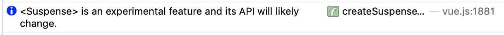

Vue-next (Vue 3) has been out for a while. It is now under release candidate stage which means there won't be big changes on the open APIs. Good to see that Vue has already been stabilized and ready to waltz into our projects.

I have to say that Vue 2 is already amazing enough. But with Vue 3's new features, it's likely to upgrade our projects to an upper level. I guess the most thrilling feature in Vue 3 would be the composition APIs. Evan You himself mentioned that the composition APIs are inspired by the React hooks. Even though the two APIs hooks and compositions are a lot alike, but from the code base they are completely different. Let's not discuss which is better or promising because I don't really think either framework outraces another.

In all, it's so happy to see that Vue can also do what React does. Let's have a close look at the new features.

**TLDR;**

## 1. Vite

This is another work of art by Evan You which is aim at replacing [Webpack](https://webpack.js.org) in Vue development (Currently only works for Vue). It is designed to be **fast** just as its French name implies.

### Getting started with Vite

The official repo offers us a simple way to create a Vue 3 app via [Vite](https://github.com/vitejs/vite).

#### Npm

```bash
$ npm init vite-app <project-name>
$ cd <project-name>
$ npm install
$ npm run dev
```

#### Yarn

```bash
$ yarn create vite-app <project-name>
$ cd <project-name>
$ yarn
$ yarn dev
```

#### Start Dev Server

It all happened in a blink of eyes.

```bash
 ❯ yarn dev
yarn run v1.22.4
$ vite
vite v1.0.0-rc.4

  Dev server running at:
  > Local:    http://localhost:3000/
  > Network:  http://192.168.3.2:3000/
  > Network:  http://10.80.67.216:3000/
```

Open http://localhost:3000/


### vue-next-features

- [repository link](https://github.com/daiyanze/vue-next-features)
- [demo link](https://daiyanze.com/vue-next-features/dist/)

I created a small app to [demo](https://daiyanze.com/vue-next-features/dist/) the new features of Vue 3. If you take a look at the projects' `package.json`, the simplicity of [vue-next-features](https://github.com/daiyanze/vue-next-features) dependencies will make you fond of [Vite](https://github.com/vitejs/vite) immediately. (I mean, who doesn't want a simpler `package.json` to start with?)

There is another Vue 3 "Hello World" repo ([vue-next-webpack-preview](https://github.com/vuejs/vue-next-webpack-preview)) bundled with [Webpack](https://webpack.js.org). It is also a good playground.

[**vue-next-features**](https://github.com/daiyanze/vue-next-features)

```json
{
  ...,
  "dependencies": {
    "vite": "^1.0.0-rc.4",
    "vue": "^3.0.0-rc.5"
  },
  "devDependencies": {
    "@vue/compiler-sfc": "^3.0.0-rc.5"
  }
}
```

[**vue-next-webpack-preview**](https://github.com/vuejs/vue-next-webpack-preview)

```json
{
  ...,
  "dependencies": {
    "vue": "^3.0.0-beta.2"
  },
  "devDependencies": {
    "@vue/compiler-sfc": "^3.0.0-beta.2",
    "css-loader": "^3.4.2",
    "file-loader": "^6.0.0",
    "mini-css-extract-plugin": "^0.9.0",
    "url-loader": "^4.0.0",
    "vue-loader": "^16.0.0-alpha.3",
    "webpack": "^4.42.1",
    "webpack-cli": "^3.3.11",¥
    "webpack-dev-server": "^3.10.3"
  }
}
```

## 2. Composition API

As the biggest the change of [Vue.js](https://vuejs.org), the composition API would become your next most frequently and commonly used feature. Just like [React hooks](https://reactjs.org/docs/hooks-reference.html#), with the Vue composition API will help gain more customizibilities.

Here is a list of the Vue 3 composition APIs. (There are actually more...)

- Reactivity
  - `computed`&nbsp;`reactive`&nbsp;`ref`&nbsp;`readonly`
  - `watch`&nbsp;`watchEffect`&nbsp;`unref`&nbsp;`toRefs`
  - `isRef`&nbsp;`isProxy`&nbsp;`isReactive`&nbsp;`isReadonly`
  - `customRef`&nbsp;`markRaw`&nbsp;`shallowReactive`
  - `shallowReadonly`&nbsp;`shallowRef`&nbsp;`toRaw`

- Lifecycle Hooks
  - `onBeforeMount`&nbsp;`onBeforeUnmount`&nbsp;`onBeforeUpdate`&nbsp;
  - `onMounted`&nbsp;`onUpdated`&nbsp;`onErrorCaptured`&nbsp;
  - `onRenderTracked`&nbsp;`onRenderTriggered`&nbsp;`onUnmounted`&nbsp;
  - `onActivated`&nbsp;`onDeactivated`&nbsp;

Visit Vue 3 official doc to know more about these APIs.
[https://v3.vuejs.org/api/composition-api.html](https://v3.vuejs.org/api/composition-api.html)

### Component Styles

#### In Vue 2

Use configuration template to define the component contents. In Vue 3, this legacy usage is still available. If you'd prefer this style, you can continue using it.

```html
<template>
  <button @click="count++">count: {{ count }}</button>
</template>

<script>
const multiplier = 2

export default {
  data () {
    return {
      count: 0
    }
  },
  computed: {
    result () {
      return this.count * multiplier
    }
  },
  mounted () {
    console.log(this.count)
  },
  watch: {
    count (val, oldVal) {
      console.log(val, oldVal)
    }
  }
}
</script>
```

#### In Vue 3

To use the composition API, you'll need to add a `setup` property in to the default export. The below code is completely equivalent to the [code above](#in-vue-2).

```html
<template>
  <button @click="count++">count: {{ count }}</button>
</template>

<script>
import { computed, reactive, toRefs, onMounted, watch } from 'vue'

export default {
  setup () {
    const multiplier = 2

    const state = reactive({
      count: 0
    })

    const result = computed(() => {
      return state.count * multiplier
    })

    onMounted(() => {
      console.log(state.count)
    })

    watch(state.count, (val, oldVal) => {
      console.log(val, oldVal)
    })

    return {
      ...toRefs(state)
    }
  }
}
</script>
```

#### Go Ahead with the new API

There are 4 reasons why you should use composition API over the default Vue 2 config template:

- To increase readability of source code
- To avoid duplicated or redundant logics
- To group up similar logics
- **To reuse the logics**

Compared to the Vue 2 configuration style, the logics are precisely broken down into smaller particals so that you could group the similar logics together easily. In this way, it also reduces chances jumping around from irrelavant logics. This will help increase the productivity without a doubt.

## 2. Advanced Reactivity API

Personally, I think this is nothing different to the other reactivity APIs. But it indeed offers those abilities of handling edge cases like **custom hooks** and **shallow layer modification**. It is now part of the [basic reactivity API](https://v3.vuejs.org/api/basic-reactivity.html) according to the Vue 3 official doc.

In the [Vue composition api](https://composition-api.vuejs.org/) doc (Yes, there's a doc only for the composition APIs), the following APIs are listed as **advanced reactivity apis**.

- customRef: custom hook
- markRaw: not able to be a `reactive`
- shallowReactive: Object's first layer `reactive`
- shallowReadonly: Object's first layer `readonly`
- shallowRef: Object's value not `reactive`
- toRaw: restore a `reactive` to normal Object

Are you farmiliar with `Debounce`? Here is an official demo of `customRef`:

```js
import { customRef } from 'vue'

const useDebouncedRef = (value, delay = 200) => {
  let timeout
  return customRef((track, trigger) => {
    return {
      get() {
        track()
        return value
      },
      set(newValue) {
        clearTimeout(timeout)
        timeout = setTimeout(() => {
          value = newValue
          trigger()
        }, delay)
      },
    }
  })
}

export default {
  setup () {
    return {
      text: useDebouncedRef('some text')
    }
  }
}
```

## 3. v-enter-from / v-leave-from

In Vue 2, the `<Transition>` component helps handle the component `animation` / `transition`. But the component property `v-enter-active`&nbsp;`v-enter`&nbsp;`v-enter-to` were quite ambiguous to me. Sometimes I'm confused which happens first.

Now in Vue 3, those transition property names became more unified and intuitive.

- `v-enter` => `v-enter-from`
- `v-leave` => `v-leave-from`

```html
<template>
  <transition name="fade">
    <div v-show="show">fade transition</div>
  </transition>
</template>

<script>
import { reactive, toRefs } from 'vue'
export default {
  setup () {
    const state = reactive({
      show: true
    })

    setTimeout(() => {
      state.show = false
    }, 1000)

    setTimeout(() => {
      state.show = true
    }, 2000)

    return {
      ...toRefs(state)
    }
  }
}
</script>

<style>
.fade-enter-from,
.fade-leave-to {
  opacity: 0;
}

.fade-enter-to,
.fade-leave-from {
  opacity: 1;
}

.fade-enter-active,
.fade-leave-active {
  transition: opacity 2000ms;
}

</style>
```

The transition order:

1. `v-enter-from` (v-enter)
2. `v-enter-active`
3. `v-enter-to`
4. `v-leave-from` (v-leave)
5. `v-leave-active`
6. `v-leave-to`

I believe this is much easier to understand, isn't it?

## 4. Allow Multiple Root Element

Vue 2 throws errors on multiple root element. All elements must be nested within one root element in the template.

```html
<!-- Error -->
<template>
  <div>pitayan</div>
  <div>blog</div>
</template>

<!-- One Root Element only -->
<template>
  <div>
    <div>pitayan</div>
    <div>blog</div>
  </div>
</template>

```

Vue 3 removed this annoying usage. I think this is extremely helpful when you really don't want to nest your elements within a "container" parent. Sometimes all you need is maybe just to insert those bare elements into the right place.

This works similarly to the [React Fragments](https://reactjs.org/docs/fragments.html) which helps mitigate the nesting issues.

```html
<!-- Vue 3 Multiple Root Element -->
<!-- Okay -->
<template>
  <div>pitayan</div>
  <div>blog</div>
</template>
```

## 5. "Filters" is Deprecated(Removed)

I think a lot of people think that `filters` is maybe an awesome feature of Vue.js. It indeed works well in Vue's template engine. (For example, data formatting / calculation etc).

Let's see how Vue 3 doc explains why `filters` is removed:

> While this seems like a convenience, it requires a custom syntax that breaks the assumption of expressions inside of curly braces being "just JavaScript," which has both learning and implementation costs.

I believe it's nothing bad for development without the `filters`, even though it may cost you extra time on migrating to Vue 3. In my projects, the appearance of `filters` is pretty a rare case since I could replace such functionality with a `method` or `computed` easily. Because in my opinion, `method` / `computed` has higher readability than the `filters`.

```html
<template>
  <!-- Deprecated (removed) & Error -->
  <span>{{ count | double }}</span>

  <!-- If you have to use fiter, make it a function -->
  <span>{{ double(count) }}</span>
</template>

<script>
import { ref } from 'vue'

export default {
  // Not working
  filters: {
    double (val) {
      return val * 2
    }
  },
  setup () {
    const count = ref(1)
    return {
      count,
      double: val => val * 2
    }
  }
}
</script>
```

## 6. New Async Component: Suspense

This is perhaps the only new feature of Vue 3 that may be changed even after official release. The inspiration is also from [React Suspense](https://reactjs.org/docs/concurrent-mode-suspense.html). So the usage scenario would be the same in my opinion.



Do you remember how you render the asynchronous data previously in Vue 2? I think `v-if` / `v-else` should be the answer.

```html
<template>
  <div>
    <div v-for="i in items" :key="i">{{ i }}</div>
    <div v-else>loading...<div>
  </div>
</template>

<script>
export default {
  data () {
    return {
      items: null
    }
  },
  mounted () {
    this.items = await new Promise(resolve => {
      setTimeout(() => {
        return resolve(['one', 'two'])
      }, 3000)
    })
  }
}
</script>
```

With `Suspense` component, you can do it without handling conditions yourself. By setting up the `default` and `fallback` slot, the `Suspense` component will handle the async event automatically.

```html
<template>
  <suspense>
    <template #default>
      <div v-for="i in items" :key="i">{{ i }}</div>
    </template>

    <template #fallback>
      Loading...
    </template>
  </suspense>
</template>

<script>
export default {
  async setup () {
    const items = await new Promise(resolve => {
      setTimeout(() => {
        return resolve(['one', 'two'])
      }, 3000)
    })

    return {
      items
    }
  }
}
</script>
```

## 7. Display it elsewhere: Teleport

It is another cool stuff based on [React Portals](https://reactjs.org/docs/portals.html). It provides the ability to insert the component to a target DOM Node.

What we do in Vue 2 to insert a custom component in `<body>` (Of course there is a Vue 3rd party plugin [PortalVue](https://portal-vue.linusb.org) providing such functionality):

```js
import Vue from 'vue'

const Ctor = Vue.extends({
  template: `<div>hello world</div>`
})

const vm = new Ctor({ ... }).$mount()

document.body.appendChild(vm.$el)

```

To use such feature in Vue 3, wrap your target component within `<Teleport>` and define the destination Node (querySelector) in `to` property.

```html
<template>
  <Teleport to="body">
    <div>Pitayan</div>
  </Teleport>
</template>
```

## 8. Allow Multiple v-model

`v-model` is used for data two-way bindings in form elements or even custom components. In Vue 2, a custom component can only have one `v-model` in the tag.

```html
<template>
  <my-input-form v-model="input" />
</template>
```

Vue 3 removed the limitation and allows you to have multiple `v-model` so that you could specify the bindings separately for more input elements.

```html
<template>
  <my-input-form
    v-model:first="inputFirst"
    v-model:second="inputSecond"
    />
</template>
```

## 9. Global APIs

Vue 3 offers some new APIs to help us control the components and instances better.

### createApp

In Vue 2, `Vue` can be used as constructor to return an instance Object. In Vue 3, you could use `createApp` function instead. The behavior is actually the same.

```js
// Vue 2
import Vue from 'vue'
import App from '@/src/App'

new Vue({
  el: '#app',
  components: {
    App
  }
})
```

```js
// Vue 3
import { createApp } from 'vue'
import App from '@/src/App'

const app = createApp(App)
```

What about those global methods like `extend`&nbsp;`component`&nbsp`mixin` and `directive`?

Same, but you need to use the instance method instead.

```js
// Global methods
app.extend()
app.component()
app.mixin()
app.directive()
```

### nextTick

I think `nextTick` is a frequently used API since a lot of the logics are actually asynchronous and they need to be arraged to the next DOM update cycle.

In Vue 2, `nextTick` is an instance method.

```js
export default {
  ...,
  mounted () {
    this.$nextTick(() => {
      console.log('pitayan')
    })
  }
}
```

Vue 3 allows to you use `nextTick` as an independent function.

```js
// nextTick function type
export declare function nextTick(fn?: () => void): Promise<void>;
```

```js
// An official doc Example
import { nextTick } from 'vue'

export default {
  setup () {
    const message = ref('Hello, Pitayan!')

    const changeMessage = async newMessage => {
      message.value = newMessage
      await nextTick()
      console.log('Now DOM is updated')
    }
  }
}
```

### Other Helper Functions

These new APIs will be extremely helpful when you need extra controls for much more abstracted scenarios. I personally think that they can be frequently used in the 3rd party libraries.

- **h:** return virtual node
- **createRenderer:** custom renderer that can be used for cross-environment purposes
- **defineComponent:** type the Object passed in
- **defineAsyncComponent:** load async component when necessary
- **resolveComponent:** resolve a component within the current instance scope
- **resolveDynamicComponent:** resolve a dynamic component within the current instance scope
- **resolveDirective:** get a `directive` from the current instance scope
- **withDirectives:** applies `directive` to a `VNode`

## Conclusions

I'm very happy and honored to vitness the growth of Vue.js 2.x => 3.x. Vue team concludes what was not possible natively in Vue 2 and made them possible in Vue 3. As I could see that there are many familar stuffs from Vue 3's code base.

It's not hard to tell that Vue 3 is a much more solid framework. It provides a new and simpler way to organize your source code,  meanwhile smaller and faster. And under the help of `Typescript` and their new features for instance composition API, projects' structure can become very much different than before. Which I believe is a positive impact to the front end community.

That's all for the Vue 3's new feature.

If you think this article is great. Please share it to the social networks. Thanks for reading.

## References

- [https://v3.vuejs.org](https://v3.vuejs.org/)
- [https://vuejs.org/v2/](https://vuejs.org/v2/)
- [https://composition-api.vuejs.org/](https://composition-api.vuejs.org/)
- [https://reactjs.org/docs/](https://reactjs.org/docs/)
