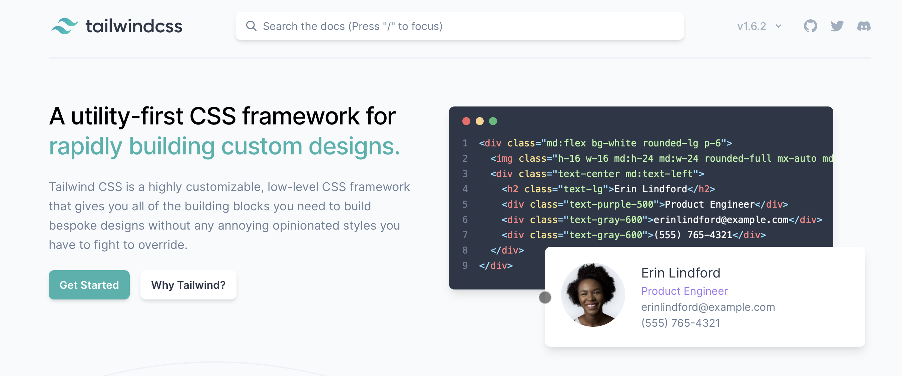
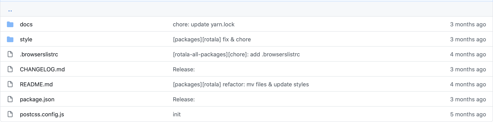
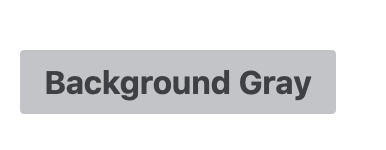

In 2019, I created a CSS framework and named it [Rotala.css](https://rotalacss.com?ref=pitayan). After some refactorings and modifications, I finally released the "toy" framework in 2020. But still it is under prototyping because I think my solution is not yet elegant.

## The Beginning

The reason why I built this framework is simple:

> I want a css framework myself

I knew it will cost me a lot of time to start building it from scratch. So I hope to create such framework by standing on the shoulder of some other powerful tools in order to speed up my development.

At first, I started prototyping with `SASS`. It is a tool that allows you to combine a lot of unique grammars so that you could experience designing with CSS like programming.

```scss
@mixin button-icon {
  margin: 0 2px;
}

.button {
  padding: 2px;

  @include button-icon;
}
```

Frankly speaking, I learned a lot of good techniques from other famous frameworks like `Bootstrap` & `Bulma` & `Spectre` & `Miligram`. And I borrowed some good designs from them especially from `Spectre.css` (There's no shame about reinventing the wheels by imitating others).

## A Remake Attempt

CSS was never my expertise. So I didn't expect any goodies from my initial prototyping. Everything I made the first time was frigile and "copy-cat". There's no "I-created-it" in the framework.

Even it was just an unexperienced attempt, how could I undertake such bad result?

Without a doubt, I started it over.

> This time, I'll make a great one. Great enough to make me smile.

By a lucky chance, I saw a video talking about a different CSS framework `Tailwind.css` which made everything nicer. It is perhaps the time to give it a go.



`Tailwind.css` allows you to build your own framework with their "partical" styling classes. I'm quite into such solution since it is the original usage of styling HTML templates.

```html
<button class="mx-4 p-2 text-gray-600 bg-gray-300">button</button>
```

Everything in `Tailwind.css` is segmented tiny enough so that writing these classes into the element is just like putting the building blocks together.

However, my [Rotala.css](https://rotalacss.com?ref=pitayan) will output stylesheets not templates. So it is a "must" to figure out how I could make it spit out some files on build.

The research proved my worry was redundant. All of the styles in `Tailwind.css` can be compiled into a small `css` file with proper configurations just like `SASS`.

```scss
/* Base */
@import "tailwindcss/base";
@import "./base.pcss";

/* Components */
@import "tailwindcss/components";
@import "./components.pcss";
```

The compile was made simple with `postcss-cli`

```bash
$ postcss docs/main.pcss -o docs/assets/css/rotala.css
...
```

As you can see from the build command, I completely ditched `SASS` and migrated to `Postcss`. There's nothing bad about `SASS`, but I just hope to stick with only one technology for my framework to avoid some complexities.

## Construct the Source Folder



Along with restart everything over again and again, I finally found a pattern to keep my code base in a good shape.

The source folder structure looks like this:

```txt
rotala/
  docs/
  style/
  CHANGELOG.md
  README.md
  package.json
  postcss.config.js
```

`docs/` folder is meant to hold static files that could help demonstrate the output. This is also an alternative setting for Github pages that could easily help publish static page without an extra route param.

```txt
docs/
  assets/
  base/
  components/
  index.html
  main.pcss
```

`style/` contains all of the source styles. At the beginning, I made around **20** components because I believe they are quite necessary for building the fundamental parts of a modern website. Those styles were heavily based on `Spectre.css` and `Bulma` (I'm fan of those frameworks).

```txt
style/
  base/
  components/
    Accordion/
    Typography/
    Badge/
    Breadcrumb/
    Tooltip/
    Button/
    Checkbox/
    Divider/
    Drawer/
    Table Group/
    Form Group/
    Input/
    Tab/
    Avatar/
    Link/
    Menu/
    Modal/
    Notification/
    Pagination/
    Popover/
    Radio/
    Select/
  base.pcss
  components.pcss
  main.pcss
  prefix.pcss
```

## Making Difference

When you read till this line, you may ask:
> How is it different to other frameworks since you've copied many of their designs?

I do also have the same question in my head. My intention was to create my own CSS framework. Repolishing others' work doesn't smell like a "creating-my-own" spirit. It means this small framework will forever be a toy of mine and has **no value** to other developers.

Actually, I also hope someone else could benefit from what I built. But I'm already tired of recreating everything from start. Is there a simple way to bring the dead project back to life by adding some finishing touch?

Making "different" is truly difficult especially when you don't have any good inspirations.

What if I take a step back and think about the pros and cons toward `Tailwind.css`, could I possbily build up a new feature based on the `Tailwind.css`'s legacy and its "shortcomings"? I think the answer would be a "**YES**".

```html
<div class="md:flex bg-white rounded-lg p-6">
  
  <div class="text-center md:text-left">
    <h2 class="text-lg">Erin Lindford</h2>
    <div class="text-purple-500">Customer Support</div>
    <div class="text-gray-600">erinlindford@example.com</div>
    <div class="text-gray-600">(555) 765-4321</div>
  </div>
</div>
```

Pros `Tailwind.css`:

- Non-opinionated styles
- Low level utility classes
- Design is customizable
- Plugin system
- Based on `Postcss` eco-system

Cons `Tailwind.css`:

- Template may get too "crowded"
- The file size is "big", need to be purged on build
- Utilities are less semantic

Even there are some down sides of `Tailwind.css`, I think they can be outweighed by the `Pros` far easily. So in my framework, I'll need to figure out plans on dealing with those `Cons`.

Have to say the 2nd and 3rd `Cons` are already part of the `Tailwind.css`'s "feauture" which I cannot get rid of. But the first one "crowded template" seems fairly easy to balance with. Thanks to the `Tailwind.css`'s powerful function, I could also write my styles in this way:

```scss
.container {
  @apply bg-white rounded-lg p-6;

  @screen md {
    @apply flex;
  }
}

```

I believe the blow usage looks much nicer, isn't it.

```html
<div class="container">
  ...
</div>
```

And if I hope to change the `container` a little bit, I could also use the "template style" to decorate it directly.

```html
<div class="container font-bold mx-2">
  ...
</div>
```

I clearly understand that I'm not the first one to think in this way, but at least this can be a good feature of my framework to standout among other frameworks.

## The Core Feature

As I hope to make differences for my framework, I came up with such core feature to accomplish.

- "Design-less" & "Extensible" components

First of all, `Tailwind.css` is "design-less". It gives full control of the stylings to us developers. I will follow that and make sure all my components are just skeletons that contains very rudimentry styles. By meaning "rudimentry styles", components will have fonts text-size color background-color padding margins et cetera if necessary.

```scss
.button {
  @apply appearance-none;
  @apply select-none;
  @apply align-middle;
  @apply font-medium;
  @apply text-center;
  @apply text-base;
  @apply no-underline;
  @apply leading-normal;
  @apply whitespace-no-wrap;
  @apply inline-block;
  @apply cursor-pointer;
  @apply rounded-sm;
  @apply py-1 px-3;
}
```

In this way, all of the components can be modified into the desired shape just by adding the new styles to override. It follows the original practice of how we should handle the CSS stylings.

Suppose we are styling the "skeleton button":

from this:


to this:



```html
<button class="button text-gray-700 bg-gray-300 hover:bg-gray-500 transition-colors duration-150">
  Background Gray
</button>
```

In a brief expression:

> Class + Utilities = Your stylish component

It may look too crowded in the template. So the better way to use it is maybe to **extend** the current `class` instead.

```scss
.button {
  @apply text-gray-700;
  @apply bg-gray-300;
  @apply transition-colors
  @apply duration-150;

  &:hover {
    @apply bg-gray-500;
  }
}

```

## Conclusions

The rest of the tasks will be to implement all other components I hope to have in the framework. It took less time creating each of them than before because I defined how to use the "skeleton" components as a core feature.

Now there are all essential components for building a website. The blog page you are reading is actually utilizing the [Rotala.css](https://rotalacss.com?ref=pitayan) framework. There are still a lot of drawbacks but in my opinion it is such an achievement for me to create something I'm not good at from totally 0.

Anyhow, I'll continue developing the framework. I'd appreciate that you are also interested in my little work here. Feel free to drop me emails to tell about your opinions of [Rotala.css](https://rotalacss.com?ref=pitayan). Any PRs or issues are welcome!

About how to use [Rotala.css](https://rotalacss.com?ref=pitayan), refer to the document by clicking the link below.

[https://rotalacss.com](https://rotalacss.com?ref=pitayan)
