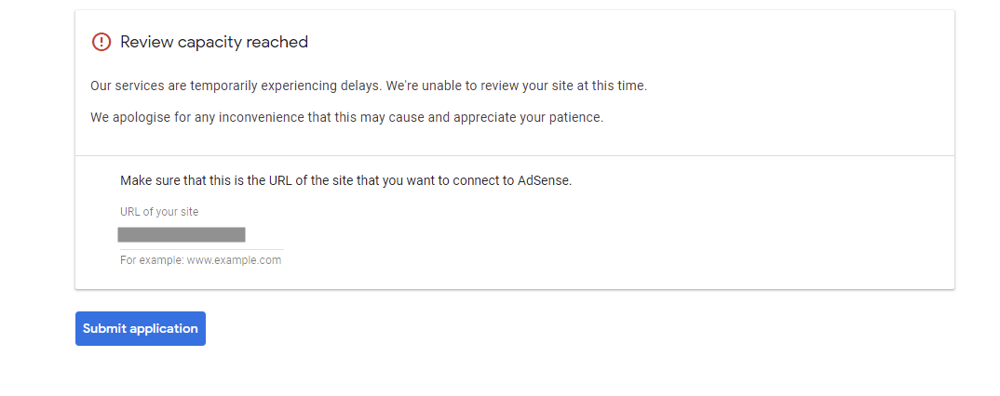
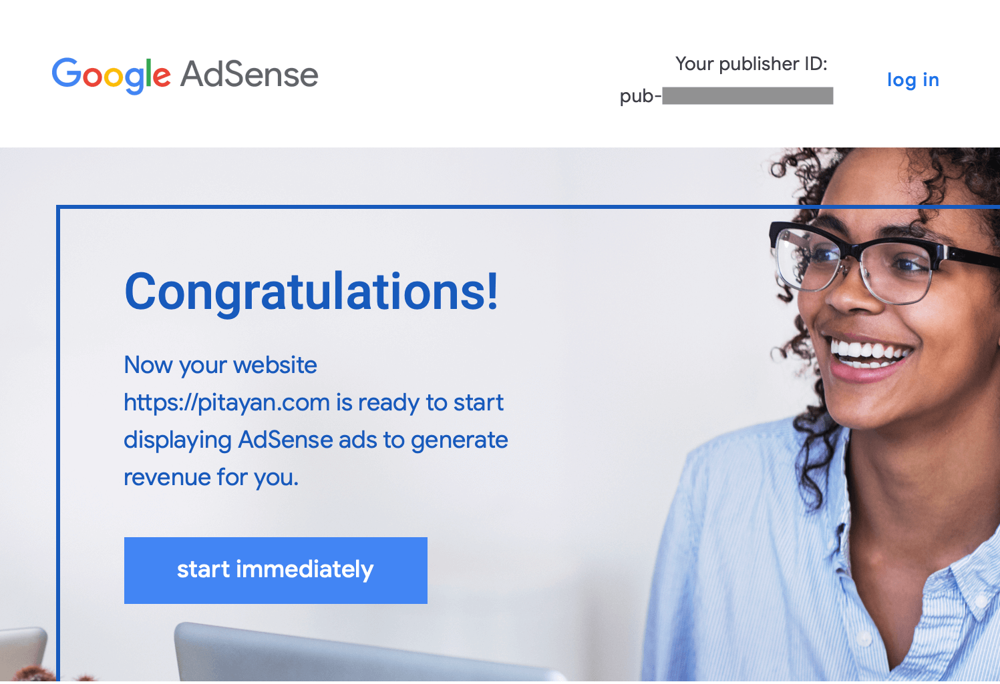
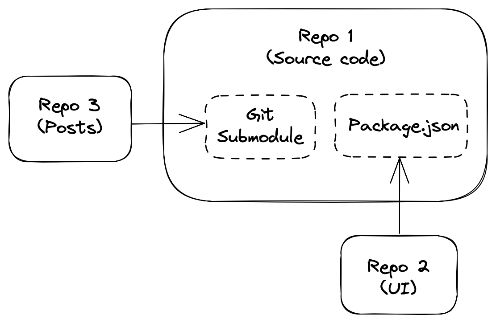
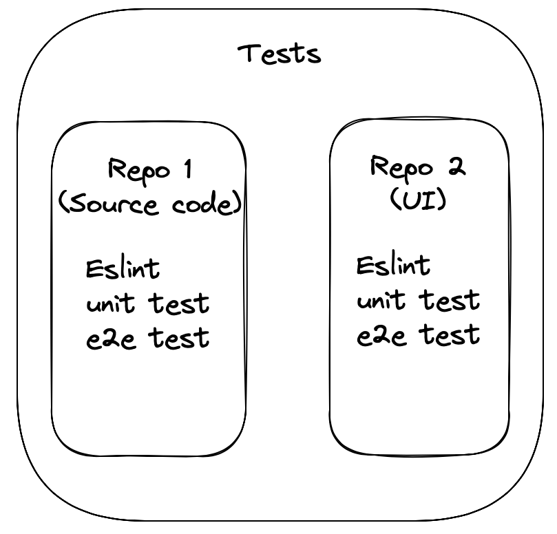
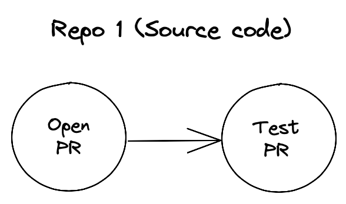
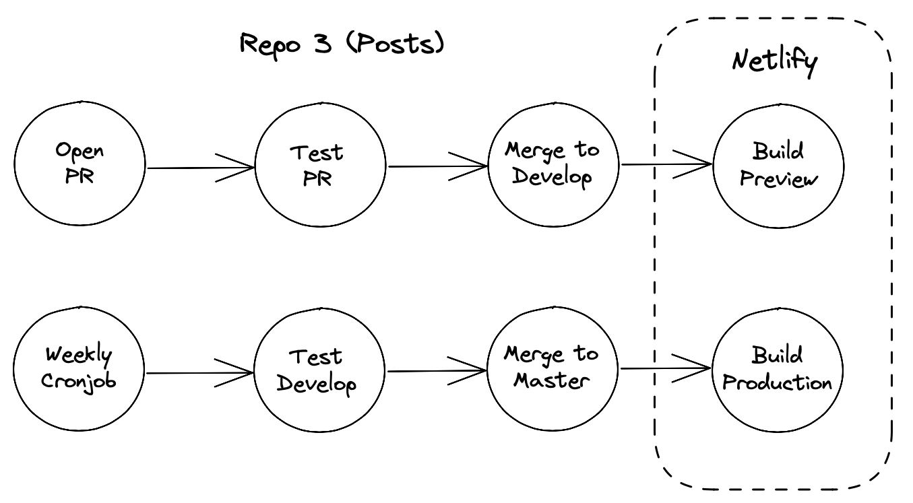
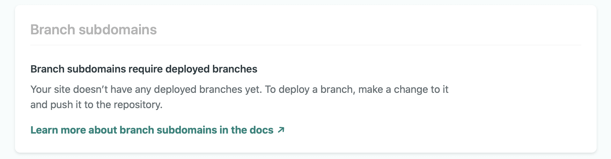
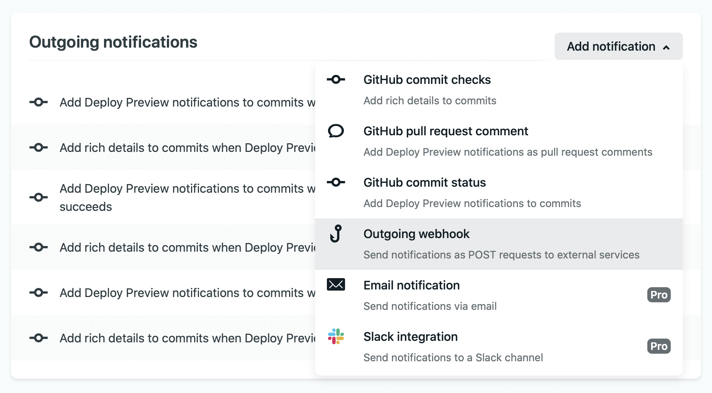
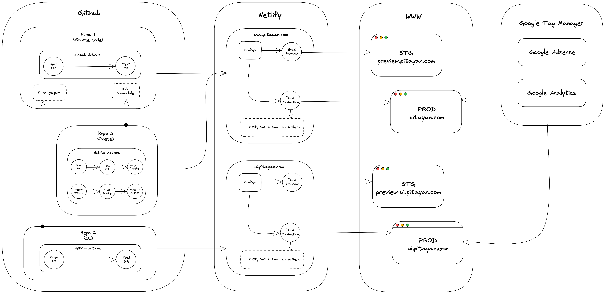

Recently I've decided to remake this whole blog to improve its workflow and UI/UX. This article will uncover my story of creating this blog and also some thoughts about the "remake" approach.

## TLDR;

---

 
 
 

# The beginning

In 2020, I spent some weeks on building a tech blog [Pitayan.com](http://pitayan.com) using some popular technologies — [Gridsome](https://gridsome.org) & [Netlify](https://netlify.com). At the beginning, it seems that the blog has a natural attraction that urges me to put more efforts onto it. So I kept writing stories to share my recent studies and projects.

This little blog is totally a dream come true for me ever since the first time when I came to know about Wordpress back in 2011. The process of creating a blog using Wordpress was so fun that there's not a day without imagining how it will look like after the development is finished. In those years when I was with Wordpress, I've learned a lot about web development. If you are a frontend engineer, I bet you understand the joy and funs of tuning up the designs and program logics for a web app. 

Honestly, that Wordpress blog I made long ago was somehow a "crucial factor" of me quitting my former accounting job and decided to devote myself into software engineering. Now I can feel that it is always what you make out of the imagination brings you the most fantastic memories. So this blog I made today [Pitayan.com](http://pitayan.com) has become into that indivisible part of my life. I'm loving it!

However, it's never difficult to admit that the whole blog was created by a whim without any architectural designs. I just simply picked up some of the most cutting-edge technologies: [Vue.js](https://vuejs.org) / [Gridsome](https://gridsome.org) / [Netlify](https://netlify.com). I also attempted to create a CSS framework [Rotala.css](https://rotalacss.com) to power up the blog appearance.

Here is the article of me creating my first ever CSS framework [Rotala.css](https://rotalacss.com) — [Attempting to create a CSS framework](https://pitayan.com/posts/css-framework-attempt/).

Believe it or not, all of these "cool looking" features went through a lot of "back and forth" which consumed large amount of my time (I could have done something else much more "engineering"). Well, the final result is just in front of you, it looks elegant minimal and fashionable. Hope you find it enjoyable as well.

  <iframe src="https://giphy.com/embed/UqWpaUdQIGueToU7ig" width="100%" frameBorder="0" class="giphy-embed mark-w-md h-96" allowFullScreen></iframe>

# The "free" plans

At the time of me writing this article, my blog is hosted on [Netlify](https://netlify.com) under a free plan. All of the articles are saved in a Github private repository. It's very obvious that I'm taking advantage of "Free of charge". 

But don't take it wrong, the "free" thing here will actually charge you in a different "format" which is clearly written in the service policies and terms. 

And any day in the future, if you hope to continue using the same service but with better functionalities, the "user of inertia" will drive you directly to the port of "subscriptions" or "plans". This is how the nowaday's SaaS business converts their "traffics". (For now, the "free" plan fits me really well thanks to the "open-source spirit" from [Netlify](https://netlify.com) and [Github](https://github.com))

However I really hope the day of upgrading my account could come earlier because it means this blog has gained decent amount of traffic which becomes into a successful site and brings valuable information to the crowd.

To tell you the truth, maintaining this blog is not totally free of charge. I still have to spend some coins for some extra functions.

- Domain name on [Godaddy.com](https://godaddy.com) (20 US dollars a year)
- SEO tool from [SERanking.com](https://seranking.com) (40 * 12 = 480 US dollars a year)
(Btw, I think SEO tool isn't quite a necessary thing at the beginning. I rarely use it to help optimize the article keywords)

The expense in total is 500 US dollars for a year. Yet I made no profit out of it as of today.

# The turning point

Most of the tech blogs I've seen on the Internet don't really have ads on it. Maybe they are just blogging for hobbies, thus earnings perhaps don't really matter to them. 

For my part, advertisement is one big reason(target) for me to keep on with it. I consider it as a long-term investment with relatively low cost and high return even this may took much longer than I could imagine. 

But I always confidently believe my blog will eventually become into an "oil field" that's minting dollar bills.

During 2020's big incident "COVID-19", [Google Adsense](https://www.google.com/adsense/start) has rejected all of my applications due to the well-known "Review Capacity Reached". This prevented a lot of blog owners to convert their traffic into some real income.

I’ve also consulted with Adsense community for help. They told me that it's maybe not because [Pitayan.com](http://pitayan.com) is not eligible but it's just that Google don't really have enough auditing resources for the time being. 

After searching the answers on the community forum, I think I've found the most reliable solution which is to submit the application once a while. And then I started taking my chances clicking that submit button once a month.

Just around 2 weeks before (May 28th 2021) I started writing this article, my application for [Google Adsense](https://www.google.com/adsense/start) has been approved! It is such great news to my 2020's effort.

> Hooray 🎉🎉🎉🎉🎉🎉!

I am so excited to be able to put some advertisements to the blog pages. However, after a few days of consideration I've decided not to do it so quickly.

**why**?

Well, here are the reasons not to display ads at the moment:

- The blog isn't a well-thought product. Adding ads onto the page will significantly affect the user experience.
- There's not enough amount of traffic and not enough session time. So the ads conversion ratio will lead to a disappointing result.
- I want to migrate to [Gatsby](http://gatsbyjs.com) for a bigger community. The [Gridsome](https://gridsome.org) is good enough but the reason why I chose [Gridsome](https://gridsome.org) at the beginning is that I wanted to learn more about [Vue.js](https://vuejs.org).
Now it's time to get back to [React](http://reactjs.org) for my personal flavor. (I'll write an article about why I choose [React](http://reactjs.org) over [Vue.js](https://vuejs.org) in the end)

Above all, if I hope to implement Google advertisements I need to remake my blog [Pitayan.com](http://pitayan.com) first.

# The architecture design

Once you choose to go with static site generators like [Gatsby](http://gatsbyjs.com) or [Gridsome](https://gridsome.org), the rest of the things to do is to start writing and then deploy the articles to [Netlify](https://netlify.com) with their pre-configured starter template. Everything is so "open-box" that you don't quite need to modify a lot of things by yourself.

However this time, I hope to bring some solid engineering practices to make it robust and foreseeable. It'd be very hard to picture every single detail for each of the features. So, it's perhaps a good idea to just initialize a rather intuitive features outline in the first place. And then, I'll drill down to each of them to fill in the missing details.

## Features outline

The following items are those essential components to take into consideration. You can call it "minimal requirements".

- Github repo 1: Source code
- Github repo 2: UI
- Github repo 3 (private repo): Posts
- Tests
- Github Actions (CI/CD)
- Netlify setup
- Google Tag manager
    - Google Analytics
    - Google Adsense

## Github repos

There will be 3 major Github repos:

- **Repo 1 (Source code)**: The main repository that follows the Gatsby folder structure. [Netlify](https://netlify.com) will use this repo for builds.
- **Repo 2 (UI)**: It contains all of the necessary UI components for a blog. And also showcase the collection of components to public under a subdomain.
- **Repo 3 (Posts)**: It contains all of the blog articles.

And the 3 repos have a simple relationship among them:

> Repo 3 is a Git submodule of Repo 1. 
Repo 2 is a JS package dependency of Repo 1.

## Tests

Repo 1 (Source code) & Repo 2 (UI) will have unit tests and e2e tests. 

Repo 3 (Posts) has no tests since it's only used as a "database".

## Github Actions (CI/CD)

### Repo 1 (Source code) & Repo 2 (UI)

- Detect PR, run tests

(As a personal project, it feels quite redundant to create a PR and merge it by myself... And I'm quite used to merge the changes directly and push them to the remote repo. But I think this disobeys the "engineering spirit" 🤓, right?)

### Repo 3 (Posts)

- Detect PR, automatically merge to develop if test passed (Same to Repo 1)
- Weekly Crontab, automatically merge develop to master if test passed

Both of the CI jobs will finally trigger [Netlify](https://netlify.com) to build the source.

Note that Repo 3 (Posts) has no tests. The CI job has to collaborate with Repo 1 (Source code). The test here behaves like a logic switch to guard against anything wrong with Repo 1 (Source code) so that it won't proceed to "merge" or "build" step when test cases failed.

## Netlify

In the new architecture design, most of the settings on [Netlify](https://netlify.com) will probably stay unchanged.

Apart from the current "build & deploy" workflow, there are some "boost-up" features I want to add to [Netlify](https://netlify.com).

- Trigger **preview build** on develop branch (like a staging environment)
- Trigger **production build** on master branch
- Notify subscribers (Email & SNS) on a successful **production build** for the new post `tentative`

[Netlify](https://netlify.com) provides this "Branch subdomain" function to allow deploying a branch to a sub-domain. Which will be used as a staging environment for me to confirm the changes.

Notifying subscribers will be a very important automation feature. Usually I'll send out my new article manually to SNS subscribers after the deployment. (Unfortunately, there's no email subscribers yet 😐)

By the way, I did some research on the "post-build notification" thing but found nearly no articles about how we could send out tweets and emails after the deployment. However, there's a "Outgoing Webhook" thing for me to coupe with what's after the deployment.

Anyway, this feature may consume a lot of time throughout development and researches. Let me mark it as tentative.

## Google Tag Manager

Now [Pitayan.com](http://pitayan.com) has installed Google Analytics tags for counting page views. The implementation is together with source code. I kinda regretted not implementing the tags with Tag Manager when I noticed how powerful it is now.

With Tag Manager, the Adsense can be installed easily without any coding in the source repo.

## Put them all together

I've created a rough workflow digram to make everything intuitive and also relational. It now looks like a vivid system when put together.

# Lastly

> Is all of this worth it? It's just a blog.

Yes. I'm taking a great pain to make all aspects of a blog under control. Anyway, it's also a good opportunity to practice designing a system even though everything here seems making a mountain out of a molehill. So, in my opinion this is exactly what "engineering" looks like. It visualizes the "known" and "unknown" parts clearly and helps understand how we should approach the solutions.

There are a lot more to do including task management and integrations etc. 
I'll move on to list out all of the necessary tasks for the next step which will be written as a different article [Remake Pitayan Blog (part 2)](/posts/remake-pitayan-blog-part-2).

Can't wait to write some code and have fun with it!!

