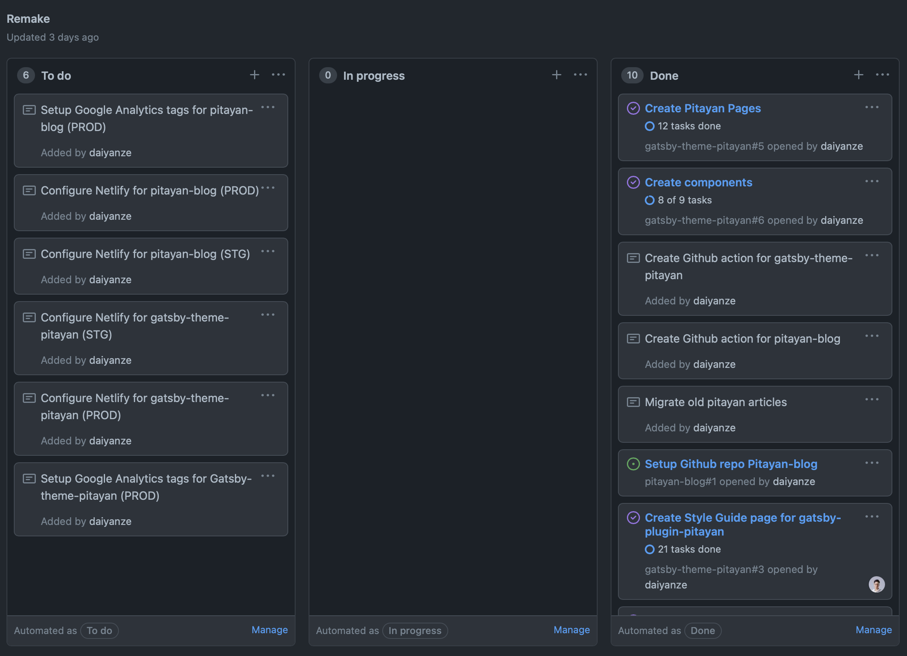
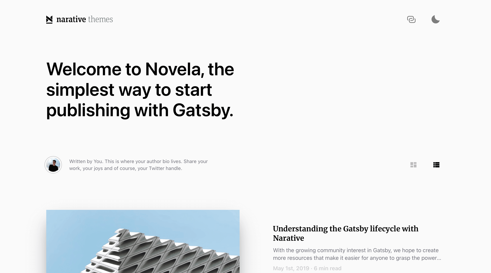
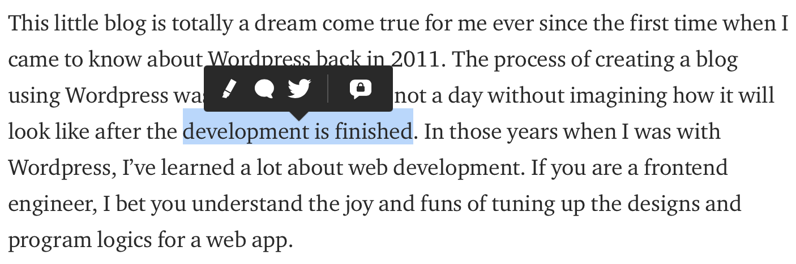

In 2021, I wrote an article of [Remake Pitayan Blog (part 1)](/posts/remake-pitayan-blog) sharing an idea of re-constructing my blog with a better design.
And finally at the same timing when this article was published, the project was initialized.

This project went quite a long way for over 10 months. I never thought this whole project would ever spend so much time to complete. 
As of this day when this article is written, Pitayan blog is officially updated to this new version.

## Setting up the objectives

I can only use my spare time on my personal projects. And almost all of my time were spent on function developments and fixing bugs.
As a consequence, those intermittent contributions caused many back and forth due to lacking of appropriate objectives ahead of starting those projects.

<p>
  <iframe src="https://giphy.com/embed/yv1ggi3Cbase05a8iS" width="100%" frameBorder="0" class="giphy-embed mark-w-md h-96" allowFullScreen></iframe>
</p>

Thus this time, I setup some practical objectives and list out the necessary "todos" under each of its items. 
I know that if I don't keep a track on what to do and what has been done somewhere, 
then resuming the process of this project later after some break may become very problematic.

To begin with creating objectives, I wrote down some notes around the following aspects:

- The blog new UI design
- Implement the blog with Gatsby (as a plugin)
- Create necessary pages
- Migrate articles from the current blog

(And actually in the next following months, the development kept running toward that direction without any turnings.)

For managing objectives, I utilized [Github "Projects"](https://github.com/orgs/Pitayan/projects/1) feature to help me manage issues and notes. As you could see there are still quite a few more tasks to do for this project.
Although some of the tasks are not very fine-grained, they are yet helpful every time when I hope to recall the latest progress.



## Migrating from "Gridsome" to "Gatsby"

The previous [article](/posts/remake-pitayan-blog) mentioned why to migrate away from [Gridsome](https://gridsome.org)

> I want to migrate to Gatsby for a bigger community. 

It is a very interesting but a very time-consuming step to me. But I believe the outcome of this step will eventually turn out to be the right decision.

[Gatsby](https://gatsbyjs.org) provides a solid user guide that let me get started quickly without digging into their source code for solutions.
And meanwhile, [Gatsby](https://gatsbyjs.org)'s rich plugin library helps extending the functions rather easily(even with only official plugins). 

Since it's a complete rewrite, I followed some example repos to scratch my own project. (Want to say thanks to these repo owners and contributors)

- [gatsby-theme-novela](https://github.com/JorgeX/gatsby-theme-novela) (Unfortunately, the original repo was out of maintenance and removed by the owner. This is a fork)
- [gatsby-starter-blog-dev-mdx](https://github.com/rossettiquette/gatsby-starter-blog-dev-mdx)
- [gatsby-starter-tailwind-mdx-blog](https://github.com/Sridatta19/gatsby-starter-tailwind-mdx-blog)
- [gatsby-mdx-blog-starter-project](https://github.com/rwieruch/gatsby-mdx-blog-starter-project)

These years, many CSS frameworks claims their helpful features are able to solve developers' pain points.
At first, frameworks using CSS-in-JS like [styled-components](https://styled-components.com) & [emotion](https://emotion.sh/docs/introduction) were taken into consideration judging their community relativity toward React.js.

I started using [Tailwindcss](https://tailwindcss.com) from long ago, and felt it extremely handy and flexible (maybe I'm just quite used to it already). 
So, in this project, I want to try with [Tailwindcss](https://tailwindcss.com) again.

And for the core plugins, the following ones are chosen based upon the official starters. (Guess almost every developer would pick these up no matter what)

- [gatsby-plugin-mdx](https://github.com/gatsbyjs/gatsby/tree/master/packages/gatsby-plugin-mdx): need to allow using React components in Markdown source for a quick feature enhancement
- [gatsby-plugin-sharp](https://github.com/gatsbyjs/gatsby/tree/master/packages/gatsby-plugin-sharp): Image quality control
- [gatsby-plugin-image](https://github.com/gatsbyjs/gatsby/tree/master/packages/gatsby-plugin-image): Provides the images component
- [gatsby-remark-images](https://github.com/gatsbyjs/gatsby/tree/master/packages/gatsby-remark-images): Process markdown images
- [gatsby-transformer-yaml](https://github.com/gatsbyjs/gatsby/tree/master/packages/gatsby-transformer-yaml): Process Yaml file (used for author profile)
- [gatsby-transformer-sharp](https://github.com/gatsbyjs/gatsby/tree/master/packages/gatsby-transformer-sharp): Image quality control for markdown images
- [gatsby-source-filesystem](https://github.com/gatsbyjs/gatsby/tree/master/packages/gatsby-source-filesystem): You know, the very necessary plugin...

Finally, with some extra "personal-favored" plugins, I created a rough repo outline. Check out to this commit `0d23f502cb2538e51e75ea7589b1ca53722c121f` to see the beginning setup ([Github link here](https://github.com/Pitayan/gatsby-theme-pitayan/commit/0d23f502cb2538e51e75ea7589b1ca53722c121f)).

## The UI design

The previous Pitayan blog design is very good-looking to me. Back then, it was made to mimic [Medium.com](https://medium.com) and [Dev Community](https://dev.to) to a certain extent (perhaps only the color schemes :p).

But frankly speaking, creating a new design out of the thin air is quite challenging to an engineer without much of design knowledge like me. 
Thus this time when I started working on the designs, I almost copied 100% of [Novela](https://novela.narative.co)'s layout but added some personal flavors to make the difference.
Which the "difference" is actually to bring the previous designs like "page footer" & "post meta" etc to the new design.

I now have only one comment for this decision:

> Experience is a reliable beacon.



I wanted to log all of those beautiful designs somewhere like a Github issue. I made one [here](https://github.com/Pitayan/gatsby-theme-pitayan/issues/2) but it's a pity that the progress was never to date...

### Using Rotala.css?

I still remember my CSS project in 2019: [Rotala.css](https://github.com/daiyanze/rotala) which is used by the previous Pitayan blog.
This little framework seems very handy at first because it provides lots of useful CSS definitions to extend upon, especially the typographical designs.

Here is example how I implemented the classes for the components.
Such implementation style is exactly what [Rotala.css](https://rotalacss.com/docs/#why-made-it-this-way) recommends (by using `@apply` keyword to mix classes).

```sass
.site-tag {
  @apply rounded-sm;
  @apply py-0.5 px-1;
  @apply text-sm;
  @apply text-gray-800;
  @apply bg-gray-200;
  @apply hover:bg-gray-300;
  @apply transition-colors;
  @apply duration-150;
  @apply ease-in-out;

  /* Dark Mode */
  @apply dark:hover:bg-gray-700;
  @apply dark:bg-gray-800;
  @apply dark:text-gray-400;
}
```

Although this is a really cool feature to reply upon, it seems [Tailwindcss](https://tailwindcss.com) prefers users to handle their classes in the HTML template.

### Color Palette

The color of the new design is just the default setting of [Tailwindcss](https://tailwindcss.com). The default palette is already very eye-comfortable, thought it'd be not that necessary to change that so early.

<div class="mark-w-md flex flex-wrap space-y-3 text-sm text-center sm:space-y-0 sm:space-x-4 mb-8">
  <div class="w-16">
    <div class="h-16 w-16 rounded bg-gray-500"></div>
    <b>gray</b><br />
    <b>500</b>
  </div>
  <div class="w-16">
    <div class="h-16 w-16 rounded bg-red-500"></div>
    <b>red</b><br />
    <b>500</b>
  </div>
  <div class="w-16">
    <div class="h-16 w-16 rounded bg-yellow-500"></div>
    <b>yellow</b><br />
    <b>500</b>
  </div>
  <div class="w-16">
    <div class="h-16 w-16 rounded bg-green-500"></div>
    <b>green</b><br />
    <b>500</b>
  </div>
  <div class="w-16">
    <div class="h-16 w-16 rounded bg-blue-500"></div>
    <b>blue</b><br />
    <b>500</b>
  </div>
  <div class="w-16">
    <div class="h-16 w-16 rounded bg-indigo-500"></div>
    <b>indigo</b><br />
    <b>500</b>
  </div>
  <div class="w-16">
    <div class="h-16 w-16 rounded bg-purple-500"></div>
    <b>purple</b><br />
    <b>500</b>
  </div>
  <div class="w-16">
    <div class="h-16 w-16 rounded bg-pink-500"></div>
    <b>pink</b><br />
    <b>500</b>
  </div>
</div>


By the way, changing the colors with [Tailwindcss](https://tailwindcss.com) is just another piece of cake.
Overriding the theme settings in the `tailwind.config.js` will do the trick.

```js
// tailwind.config.js
module.exports = {
  ...
  theme: {
    colors: {
      primary: {
        ...
      },
      red: {
        ...
      },
      green: {
        ...
      },
      ...
    }
  }
}
```

# Some cool features

## The selection popover menu

[Medium](https://medium.com) has a popover menu displaying right above the text content you selected. 
When it pops up, you could highlight the text and add comments (and even share it to Twitter). Isn't it a wonderful feature?



Such feature also exists in the [Novela](https://novela.narative.co) blog. It doesn't support text highlight because it requires backend data.
But instead, you could copy the selected text and share it to Twitter. So I decided to mimic the Novela's selection popover feature. 
In this article, you might already noticed this feature but note that the only available area is this article content itself.

I referred to some community React libraries [react-selection-popover](https://github.com/mvanlonden/react-selection-popover) & [react-text-selection-popover](https://github.com/juliankrispel/react-text-selection-popover). 
They offered great example of how to detect selection and calculate the positions. Anyhow in the end, I have to create my own plugin / hooks to introduce this feature into the blog theme.

The reason of doing this is pretty simple: neither of those 2 libraries work perfectly in my case.

In order to make it work as expected, I created a hook to meet my demands. 

```typescript
function useTextSelection (
  container: HTMLElement = document.body,
  offsetWidth = 0,
  offsetHeight = 0,
  lineHeightDelta = 32
): { left: number top: number textContent: string }
```

The function returns `left` `top` and `textContent`. To position the popover, just set the popover mask to `absolute` together with its left and top values.

```html
<div className="selection-popover" style={{ left, top }}>
  ...
</div>
```

The `container` is the HTML element target that holds your selection content. It is a relative anchor of the selection popover container.
By default, the `html•document.body` should be a decent container. However usually, it's depending on how you gonna define your popover component.

In my case, since the popover component has to stay as descendent of the markdown content(the MDX container), it's better just to use that content tag as container.

`offsetWidth` and `offsetHeight` are used for centering the popover container. They don't have to be static values as you could grab those attributes from the HTML tag `typescript• const { width, height } = targetContainer.getBoundingClientRect()`.

In the short feature, I may create a new repo to make everyone accessible to this useful plugin. By far, the source code is also a good example I presume for those who wants to have a selection popover component in their page.

## Medium-like picture magnifier

There's a ready-to-use library called [medium-zoom](https://github.com/francoischalifour/medium-zoom) that reproduced the feature of the Medium.com's picture zoom-in.
The time when I found it, it made me so happy that I don't have to create a plugin myself to achieve the feature.

Guess there's no need to talk more about this feature. Just feel the power of it by click the picture below (or any other pictures in the article page).


Amazing, isn't it?

## Dark and light mode

Like some document sites such as [vuejs.org](https://vuejs.org), Pitayan.com now has supported *dark-mode* with the Tailwind's builtin feature.
It affects not only the usual components for site layout but also the code highlight.

Remember Tailwind's `dark` variable? It is the key to making styles inverted under dark-mode.

```sass
@apply text-gray-800;

/** Dark Mode */
@apply dark:text-gray-400;
```

You may have noticed the "sun" icon ☀️  in the top navigation bar, it triggers the theme to toggle between light and dark. (Believe you'll be enjoying using the dark-mode for protecting eyesight 🤓)

# @pitayan/gatsby-theme-pitayan

Now the Pitayan.com provides a Gatsby theme plugin so that everyone else can build their own Gatsby blog with our theme. 

Check out this Github repo: [Pitayan/gatsby-theme-pitayan](https://github.com/Pitayan/gatsby-theme-pitayan).

Following a quick installation which is also mentioned in the README file. The sad part is that it's only a plugin rather than a startup template. It still requires some more steps to get it to run locally.

```sh
$ npm install --save-dev gatsby @pitayan/gatsby-theme-pitayan react@17 react-dom@17
```

Besides, as you may noticed, at the moment it supports React 17 instead of 18 because the `peerDependency` of gatsby-plugin-mdx requires `@mdx-js/mdx: ^1.0.0`.
Let's wait until they upgrade their version dependencies. Or maybe we could force using the latest React during NPM modules installation to circumvent the warnings.

# What's next?

Finally, the new theme of Pitayan.com is released. Although there're still some bugs within the theme, they'll be fixed any day soon.

I think what's more important to the site now is automate the release process.
Believe any day soon in the future, all I need to do for publishing a new article is just "write content" and "create PR". And then it should merge the PR automatically by a Github scheduler. 
Since the Pitayan.com deploys with [Netlify](https://netlify.com), any commits to the `master` branch will trigger a new build.

I'll be publising a part-3 to introduce this automation as the last step of the "remake". Hope I could complete this as soon as possible (No more procrastinations 😆).

Thanks for reading!

